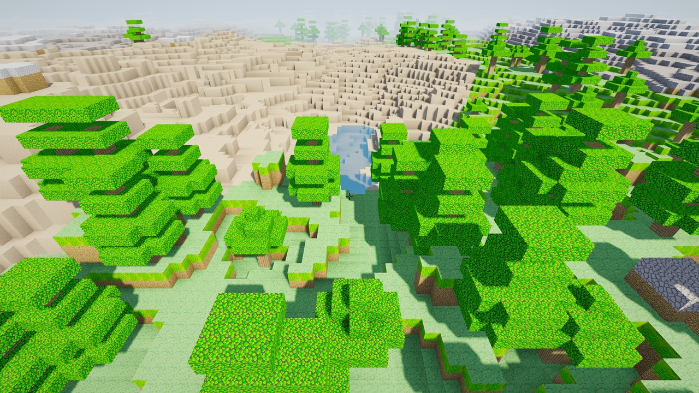
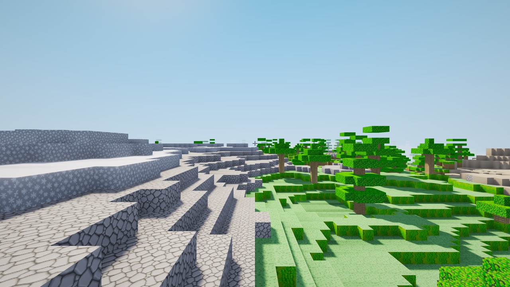
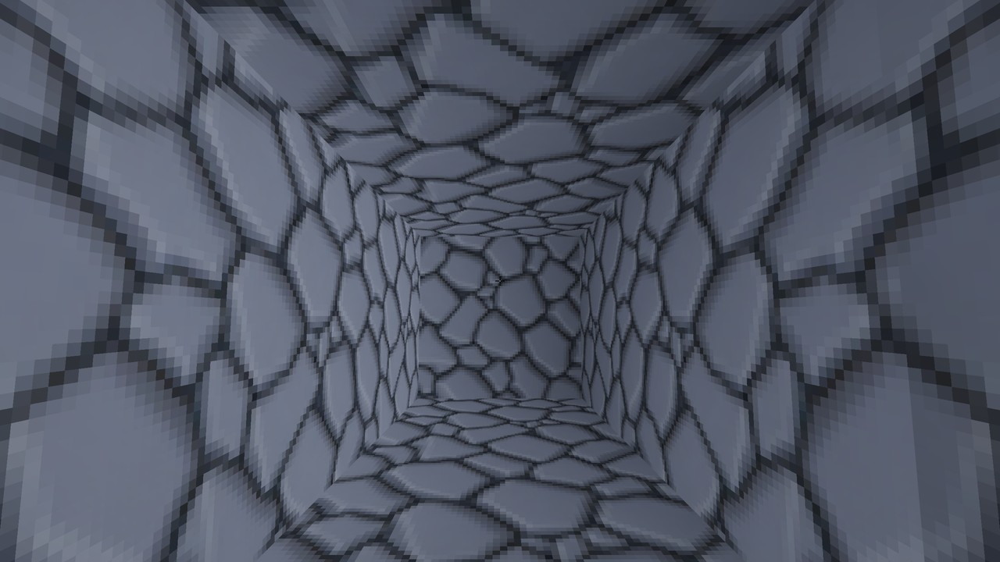

# voxel-engine

[](https://github.com/DanielWLiu07/voxel-engine/actions/workflows/ci.yml)

A desktop voxel engine I built solo over three weeks in C++20 and OpenGL 4.1
Core, to learn graphics from scratch and get some measurable performance wins
out of it. Numbers below are from my Apple M4.



|  |  |
| :---: | :---: |
| Ground level: CSM shadows, vertex AO, 64px mipmapped texture array | Inside a cave tunnel: occlusion culling draws **7 sections instead of 439** - byte-identical pixels to the unculled render |

Screenshots are reproducible: `./build/voxel_engine --screenshot-after 60
--pose center` renders a deterministic pose (locked camera, frozen shader
time) and writes a byte-stable PNG, which is also how the occlusion culler
is pixel-diff verified in development.

Block textures are **AI-generated (SDXL-Turbo) and labeled as such** - the
game shows the credit at boot and in the HUD, and every tile's model,
prompt, and seed are committed in [`TEXTURES.md`](TEXTURES.md) +
`textures/MANIFEST.toml`.

## Build

```
cmake -B build -G Ninja
cmake --build build -j
./build/voxel_engine
```

Needs CMake 3.20+, Ninja, and a C++20 compiler (Clang 15+, GCC 12+, MSVC
19.3+). First configure takes about two minutes because CMake FetchContent
clones GLFW, GLM, and Dear ImGui. macOS is the primary dev target; Linux and
Windows build clean on CI.

Pass `--bench` to run the mesher benchmark instead of opening a window:

```
./build/voxel_engine --bench
```

## Measured performance

Apple M4 (10 cores), macOS 26.2 arm64, OpenGL 4.1 Apple renderer.

**Headline (radius 12, gameplay pose, vsync off):**
5.7 ms avg frame time, **175 fps**, **29 M triangles/sec**, 253 MB peak RSS.
Chunk pipeline hits **2200 chunks/sec at 8.4x parallel efficiency** on 9
workers. Per-frame work: 396 of 5000 loaded sub-chunks drawn (12.6x
frustum + occlusion cull), 167k triangles rendered, post-process dominates
per-pass cost at ~37%. Inside a cave, occlusion culling alone cuts drawn
sections **70.8x** (283 -> 4).

Reproduce:
```
./build/voxel_engine --bench               # mesher + cull bench, CI-gated
./build/voxel_engine --bench-frame 300     # 300-frame timing bench, center pose
scripts/bench_sweep.sh                     # scaling table across radii 8..16
POSES="center ground high" scripts/bench_sweep.sh 12
scripts/bench_variance.sh 10 300 center    # run-to-run frame-time distribution
./build/queue_bench                        # lock-free vs mutex queue sweep
scripts/run_sanitizers.sh                  # TSan (concurrency) + ASan/UBSan (logic)
```

| Metric | Value |
| --- | --- |
| Greedy meshing, contiguous Perlin chunk | 18.1x fewer quads vs naive (0.9 ms build) |
| Greedy meshing, same chunk with caves carved | 7.8x fewer quads (0.9 ms build) |
| Greedy meshing, single-biome Perlin chunk (historical) | 27.7x fewer quads |
| Async chunk pipeline, radius 12 (625 chunks) | 2226 chunks/sec, 9 workers (281 ms wall: worker CPU compressed in parallel, 34 ms main-thread upload) |
| Worker breakdown (per chunk avg) | terrain.fill_chunk 0.71 ms, greedy mesh 1.68 ms, GL upload 0.05-0.14 ms |
| Frustum cull (chunks), wide AABB (pre-tightening) | 228 / 625 drawn (~2.7x) |
| Frustum cull (chunks), tight per-chunk Y AABB | 213 / 625 drawn (~2.9x) |
| Frustum cull (sections), 32-block sub-chunks, vs non-empty | 407 / 1225 drawn (~3.0x) |
| Frustum cull (sections), vs all loaded sections (radius 12) | 407 / 5000 drawn (~12.3x) |
| Occlusion cull (section-graph BFS), surface pose | 407 -> 396 sections (1.03x on open terrain) |
| Occlusion cull (section-graph BFS), cave pose | 283 -> 4 sections (**70.8x** fewer draws underground) |
| RLE chunk save compression | 39.06 MB raw -> 0.27 MB on disk (~144x) |

Frame time scaling, vsync off, `center` pose, 30-frame settle, M4
(section/triangle counts are exact at current HEAD; the ms columns are
the idle-machine measure and reproduce when the box is quiet):

| Radius | Chunks | Sections drawn | Tris drawn | Avg ms | p50 ms | p99 ms | Avg fps | Tris/sec | Peak RSS |
| ---: | ---: | ---: | ---: | ---: | ---: | ---: | ---: | ---: | ---: |
|  8 |   289 | 180 |  78,224 | 5.01 | 4.96 | 6.33 | 199.5 | 15.6M | 168 MB |
| 10 |   441 | 280 | 117,626 | 5.20 | 5.15 | 6.49 | 192.3 | 22.6M | 204 MB |
| 12 |   625 | 396 | 167,200 | 5.40 | 5.27 | 7.17 | 185.2 | 31.0M | 253 MB |
| 14 |   841 | 531 | 230,560 | 6.09 | 5.94 | 8.67 | 164.2 | 37.9M | 296 MB |
| 16 | 1,089 | 687 | 299,170 | 6.04 | 6.20 | 9.15 | 165.5 | 49.5M | 329 MB |

Triangle count grows 3.8x from radius 8 to 16; avg frame time grows
21%. Section-AABB culling holds drawn-section count close to a
constant fraction (~30% of loaded sections) while the loaded world
quadruples. Peak RSS scales sub-linearly with chunk count because the
worker pool, FBOs, and post-process chain are constant cost on top of
the per-chunk mesh and block data.

Greedy ratio depends on terrain richness. The "contiguous" number is the
mesher's algorithmic gain on continuous terrain, which is what the CI gate
enforces (>= 15x). Caves break face runs into smaller mergeable rectangles,
so the same algorithm produces fewer quads but a lower ratio. Both numbers
come out of `./build/voxel_engine --bench`.

The frustum cull rows come from `--bench`'s deterministic pose (camera at
(0, 80, 0), yaw -90, pitch -15, 70 deg FOV, 16:9). The chunk row counts
loaded chunks that survive the per-chunk tight AABB test. The section rows
split each chunk into eight 32-block vertical sections, each with its own
AABB, and count survivors.

Two denominators because both are useful:

- vs non-empty: ~1225 sections actually contain geometry; the rest
  are air the renderer never had to draw.
- vs all loaded sections: the naive "draw every loaded section" baseline.
  Bigger number, weaker comparison.

Frustum-only culling at 70 deg FOV ceilings near 3x because the cone covers
roughly a third of the surrounding disc. The section pass adds modest
tightening within visible chunks. Bigger reductions need occlusion, not
finer AABBs - which is what the occlusion rows measure.

Occlusion culling is the Minecraft-style cave-culling algorithm: each
16x32x16 section flood-fills its air cells on the worker thread and records
which of its 15 face pairs a sightline can pass between (one bit each).
Per frame, a BFS walks that connectivity graph from the camera's section -
pruned by the frustum, never reversing a direction already taken - and only
reached sections draw. On open terrain it trims the handful of sections
buried just below the surface (407 -> 396). Underground it removes nearly
everything: from a cave the frustum still admits 283 sections, but only 4
are actually reachable through air. Toggle with O in-game for the A/B. A
unit test casts a fan of line-of-sight rays through real terrain and
asserts every air cell along an unobstructed ray lands in a BFS-reached
section, so the cull can't eat geometry the camera can legitimately see.

The scaling table comes from `scripts/bench_sweep.sh`, which loops
over a list of radii (default `8 10 12 14 16`), edits `kStreamRadius`
in `src/main.cpp` in place, rebuilds, runs `--bench-frame 300`, and
restores the original radius on exit so the CI cull-bench gates keep
measuring the same world. The bench itself opens a hidden window,
locks the camera to the same pose as the cull bench, waits for the
chunk stream to settle, then collects 300 vsync-off samples and
prints one stable summary line. p99 reflects occasional heavy frames
(cascade refresh, chunk stream events). Avg is the steady-state
gameplay number at this pose.

Frame time across three named poses (`--bench-frame 300 --pose <name>`),
radius 12, M4:

| Pose | Camera | Tris drawn | Sections | Avg ms | p50 | p99 | Avg fps | Tris/sec |
| --- | --- | ---: | ---: | ---: | ---: | ---: | ---: | ---: |
| center | (0, 80, 0) yaw -90 pitch -15 | 167,200 | 396 | 5.59 | 5.48 | 11.24 | 179.0 | 29.9M |
| ground | (0, 35, 0) yaw -90 pitch 0   | 165,042 | 390 | 5.53 | 5.63 |  9.13 | 180.7 | 29.8M |
| high   | (0,150, 0) yaw -90 pitch -45 | 195,906 | 462 | 5.46 | 5.45 | 10.42 | 183.0 | 35.9M |

`ground` is eye-level walking; `high` is a top-down vantage where the
section-AABB cull's vertical pruning works hardest; `center` is the
pose the scaling table and `--bench` cull bench use. All three land
within ~2% of each other, so the headline frame time isn't an artifact
of a flattering vantage. `high` ships 19% more triangles than `ground`
(196k vs 165k) but renders in the same time: the per-section cull cost
scales together with the work the GPU does.

Per-pass breakdown at radius 12, from `--bench-frame 300 --pass-breakdown`
(glFinish bracketing makes the per-pass numbers real GPU wall time at the
cost of inflating frame-level avg_ms; that mode is a diagnostic, not the
perf number). Measured at current HEAD, mean of 3 runs:

| Pass | ms | Share |
| --- | ---: | ---: |
| post-process (HDR -> bloom chain -> ACES tonemap) | 3.73 | 37% |
| terrain (visible sections, atlas + CSM sample) | 2.19 | 22% |
| shadow pass (3 cascades, staggered) | 2.14 | 21% |
| water (sine-animated plane + Fresnel + depth fog) | 1.07 | 11% |
| sky (gradient + sun glow) | 0.90 | 9% |
| sum of measured passes | 10.03 | |

Post-process dominates; the next clear lever for frame-time savings is
halving bloom iterations or dropping the bloom mip chain a level.

## What's in here

Rendering
- Greedy mesher that merges co-planar identical faces per chunk. Area-correct
  against the naive face-culling output.
- View-frustum culling against per-chunk AABBs.
- 3-cascade parallel-split shadow mapping (PSSM) with a sphere-fit cascade
  volume, hardware PCF, texel-snapped stable cascades, and a caster pull-back
  so occluders just outside the frustum still cast.
- Staggered cascade updates: c0 refreshes every frame, c1 every second, c2
  every fourth, phase-offset so the per-frame shadow cost never spikes above
  two cascades.
- HDR pipeline (multisampled scene FBO, blit resolve, half-res bloom chain,
  ACES tonemap, saturation/contrast/vignette grading).
- Fresnel-blended water plane with sine-animated normals and depth fog.
- Sky gradient + sun glow, distance fog matched to the horizon.
- Per-face texture atlas with PNG override; grass and wood have distinct top
  and side textures.
- Per-vertex ambient occlusion baked into the mesh.

World
- 16 x 256 x 16 chunks, infinite streaming around the player with bounded
  memory.
- Multi-octave Perlin terrain with domain warping, snow band, sand band,
  three tree variants, and 3D-noise carved cave systems.
- AABB collision in walk mode, DDA voxel raycast for break/place at 8-block
  reach.
- RLE-compressed binary chunk save/load with magic + version header.

Tooling
- Worker-pool chunk streaming with main-thread-only GPU upload. Ships a
  ThreadSanitizer-clean lock-free MPMC queue (`core/mpmc_queue.h`) benchmarked
  against the mutex pool; the live path stays mutex-based because the queue is
  never the bottleneck at chunk-job granularity (see [`DESIGN.md`](DESIGN.md)).
  Concurrency + logic are checked under TSan / ASan / UBSan in CI.
- Day/night cycle with sun arc and palette ramp.
- ImGui debug HUD: frame time, FPS, drawn chunks, triangles, pending async
  chunks, copy-perf-to-clipboard.
- Tracy profiler instrumentation behind `-DVOXEL_USE_TRACY=ON`.
- F12 to PNG screenshot.

## Controls

| Key | Action |
| --- | --- |
| WASD | Move |
| Space | Jump (walk) / up (fly) |
| Left Ctrl | Down (fly) |
| Left Shift | Sprint |
| F | Toggle walk / fly |
| Left click | Break block |
| Right click | Place block |
| 1-7 | Pick block to place (Stone, Dirt, Grass, Sand, Wood, Leaves, Snow) |
| Tab | Toggle mouse capture |
| F2 | Toggle HUD |
| F5 / F6 | Save / load world (`./saves/world1/`) |
| F12 | Screenshot (`./screenshots/`) |
| C | Copy perf snapshot to clipboard |
| O | Toggle occlusion culling |
| T | Pause / resume time of day |
| `[` / `]` | Step time of day |
| V | Toggle vsync |
| Esc | Quit |

## Architecture

Layered, no globals. `gfx/` is a generic OpenGL wrapper that doesn't know
about voxels. `world/` owns voxel data and meshing. `render/` composes draw
passes from `gfx/` and `world/`. `game/` is the only layer that coordinates
player input with world state. `ui/` is the debug HUD. Chunk generation and
meshing run on a worker pool; every OpenGL call stays on the main thread.

[`DESIGN.md`](DESIGN.md) covers the threading model, the lock-free-vs-mutex
queue decision, and the measurement methodology in more detail.

```
src/
  core/    window, input, thread pool
  gfx/     shader, mesh, camera, frustum, CSM, post-process, water, atlas
  world/   chunk, terrain gen, greedy mesher, world container, streaming
  render/  lighting, draw passes (shadow, sky, terrain, water)
  game/    player, AABB physics, block interaction
  ui/      debug HUD
  main.cpp
shaders/   GLSL 4.10 core
third_party/  glad, stb, FastNoiseLite (vendored)
```

Dependencies via CMake FetchContent: GLFW, GLM, Dear ImGui. Vendored: GLAD
(GL 4.1 core loader), stb_image, stb_image_write, FastNoiseLite. Optional:
Tracy.
