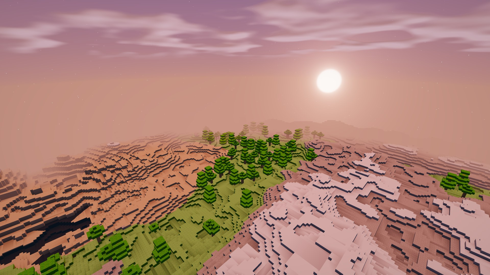
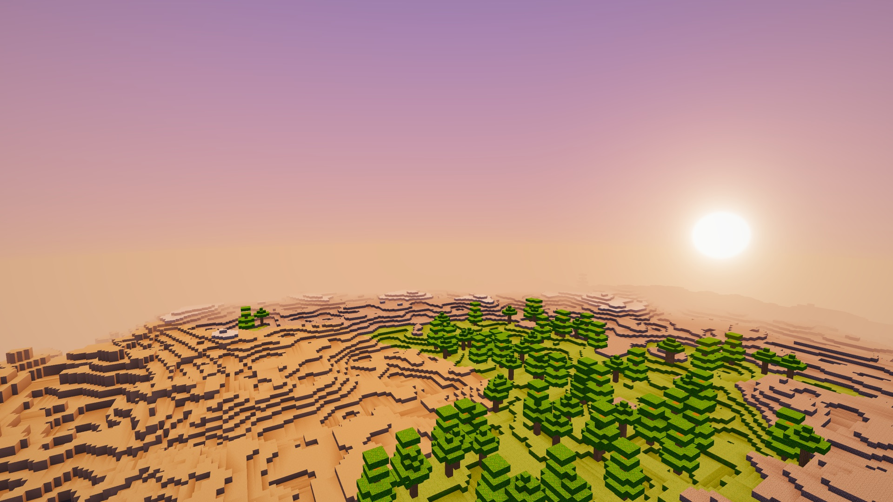
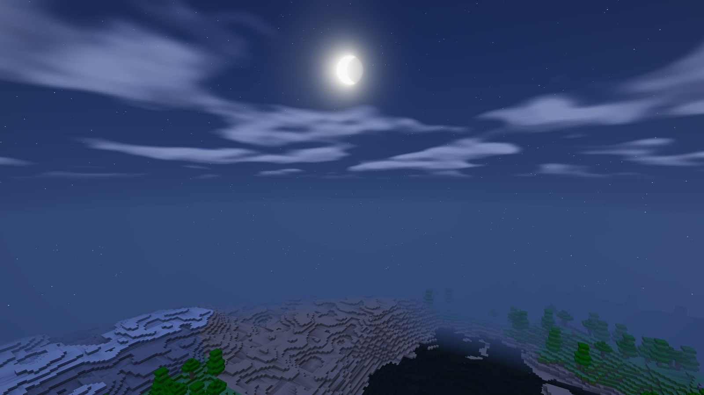
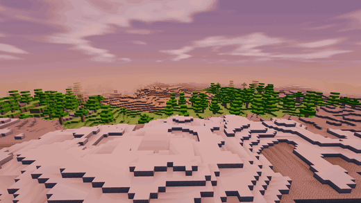
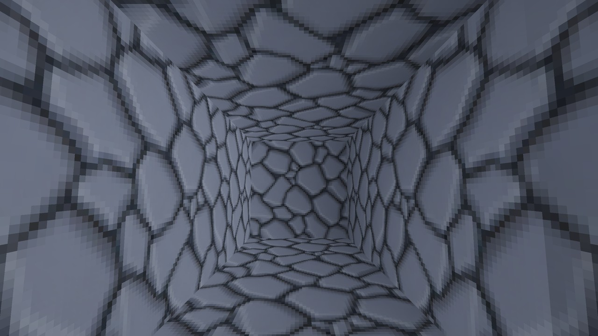
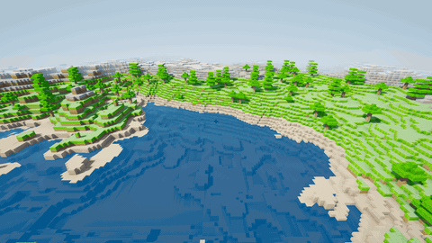
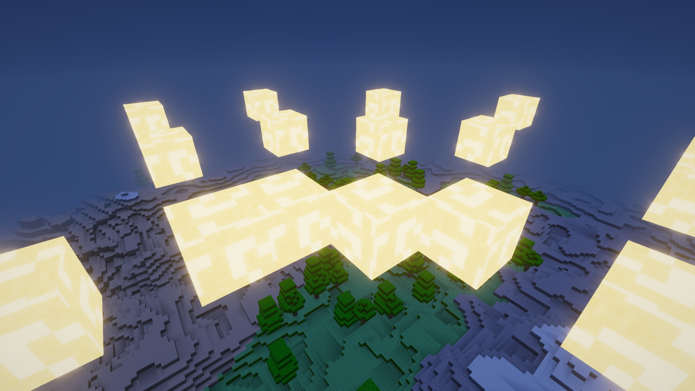
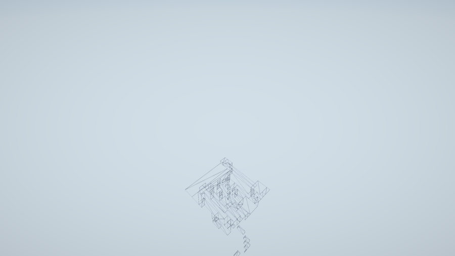
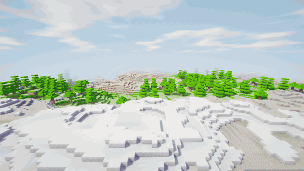

# voxel-engine

[](https://github.com/DanielWLiu07/voxel-engine/actions/workflows/ci.yml)

A desktop voxel engine in C++20 and OpenGL 4.1 Core, written solo in three
weeks. The engine is the workload; the point is that every performance
number below is checkable rather than claimed. The greedy mesher is fuzzed
face-for-face against a naive reference, the occlusion culler has to render
byte-identical PNGs or the audit fails, `--validate` reads meshes back off
the GPU and checks each triangle against the voxel data, and CI fails the
build if the merge ratio or the world's mesh footprint regresses in either
direction. Numbers are from an Apple M4.



625 chunks streamed and drawn, low sun, distance fog carrying the scale.
The clouds, the sun disc, and the first stars in that sky are one
fullscreen triangle and a fragment shader - no skybox texture, no cloud
mesh, nothing in a vertex buffer. Every still here is a deterministic
capture, not a lucky frame: the camera pose, the seed, and the hour of
the day are all arguments, so anyone can reproduce the exact image:

```
./build/voxel_engine --pose-at 40,98,40,-135,-22 --seed 1337 \
    --time-of-day 0.76 --screenshot-after 60 --shot-file vista.png
```



The same world an hour later and a hundred blocks lower
(`--pose-at 10,78,10,-150,-6 --time-of-day 0.755`). Sun disc and bloom
come from the HDR chain: multisampled scene buffer, dual-filter Kawase
bloom pyramid, ACES tonemap, then grading.



Half a day later, same shader. The moon rides the sun's own arc a half
turn behind it, so it rises exactly as the sun sets without a second
schedule to keep in sync; the stars are hashed out of the view direction
and turn with the night. Reproduce:
`--pose-at 300,105,-360,60,-4 --time-of-day 0.79`. There is more on how
the sky is built in [The sky is a shader](#the-sky-is-a-shader).



A full camera orbit over the streamed world, captured from a live run
(`./scripts/capture_clip.sh orbit` regenerates it: the engine flies a
deterministic fixed-step circle and saves every frame, ffmpeg assembles
the seamless loop).



Inside a cave tunnel: occlusion culling draws **7 sections instead of
436**, and the render is byte-identical to the unculled one.



The water surface is one sine-displaced plane that follows the player;
its normals come from the wave field's exact derivatives (plus two
normal-only detail ripples), so the lighting shows moving waves without
a denser grid. Reproduce: `./build/voxel_engine --pose-at
288,40,-340,-90,-15 --radius 10 --screenshot-after 150 --shot-file
lake.png` (seed 1337); the clip regenerates with
`CLIP_ORBIT_CENTER="288,-400,30" scripts/capture_clip.sh orbit 360
docs/media/lake_orbit.gif`.

Stills are reproducible the same way: `./build/voxel_engine
--screenshot-after 60 --pose center` renders a deterministic pose (locked
camera, frozen shader time, coord-sorted draw order) and writes a
byte-stable PNG. `scripts/verify_occlusion.sh` builds on that: it renders
each pose with the occlusion culler on and off and requires the PNGs to
be byte-identical, so the culler provably never changes a pixel -- even
in a cave where it drops 391 of 395 drawn sections.

Block textures are **AI-generated (SDXL-Turbo) and labeled as such.** The
game shows the credit at boot and in the HUD, and every tile's model,
prompt, and seed are committed in [`TEXTURES.md`](TEXTURES.md) and
`textures/MANIFEST.toml`.

**Contents:** [Build](#build) - [Measured performance](#measured-performance)
- [What's in here](#whats-in-here) - [Architecture](#architecture)
- [Controls](#controls)

The performance section is the long one, and it is meant to be skimmed by
heading: [the hardware-independent
numbers](#the-numbers-that-do-not-depend-on-the-machine) first, then
[frame cost](#frame-cost-on-an-m4), [scaling](#scaling-with-world-size),
[memory](#where-the-gpu-memory-went), [culling](#culling-measured), and
[the sky shader](#the-sky-is-a-shader).

## Build

```
cmake -B build -G Ninja
cmake --build build -j
./build/voxel_engine
```

Needs CMake 3.20+, Ninja, and a C++20 compiler (Clang 15+, GCC 12+, MSVC
19.3+). First configure takes about two minutes because CMake FetchContent
clones GLFW, GLM, and Dear ImGui. macOS is the primary dev target; Linux and
Windows build clean on CI.

Pass `--bench` to run the mesher benchmark instead of opening a window:

```
./build/voxel_engine --bench
```

## Measured performance

Apple M4 (10 cores), macOS 26.2 arm64, OpenGL 4.1 Apple renderer.

### The numbers that do not depend on the machine

The numbers worth reading first are the ones that do not depend on the
machine. A frame rate is a property of this laptop as much as of this
engine; a ratio and a byte count are properties of the engine alone, and
they reproduce exactly on any GPU:

| Hardware-independent result | Value |
| :--- | ---: |
| Greedy meshing, triangles vs naive per-face | **5.3x fewer** (CI-gated at >=4.5x), counting only faces a camera can reach |
| Vertex format, packed vs float | 40 B to **12 B**, 3.3x |
| Whole-world GPU mesh at radius 12, all three wins | 126.7 MB to **10.9 MB**, 11.6x |
| Index data per chunk, one shared quad EBO | **zero** |
| Chunk serialization, RLE vs raw | 39.06 MB to 0.67 MB, **58x** |
| Sub-chunks drawn vs loaded, underground | up to **70x fewer** |
| Chunk pipeline scaling on 9 workers | **8.4x** parallel efficiency |

### Frame cost, on an M4

Those hold whatever you run this on. The frame numbers below are what
they buy on one specific machine, and are quoted against the 60 Hz frame
budget rather than as a bare frame rate, because a budget is a fixed
target and the headroom against it carries meaning across hardware in a
way that "229 fps" does not.

**Radius 12, the default gameplay setting, vsync off:** 4.4 ms per frame
against a 16.7 ms 60 Hz budget, **3.8x inside budget** (229 fps), 38 M
triangles/sec, 188 MB peak RSS, across a **40-million-voxel** resident
world of 625 chunks.

**Largest configuration tested, radius 16:** a **71-million-voxel** world
(1,089 chunks) at 4.7 ms, **3.6x inside the same budget** (215 fps), 64 M
triangles/sec, 251 MB peak RSS, 22.1 MB of GPU mesh. A 1.7x larger world
costs 6% of the frame rate, which is the scaling claim the sweep table
below exists to support. Radius 16 needs the full 300-frame window to
reach steady state; a shorter bench reports a lower RSS because the world
has not finished streaming in.
Chunk pipeline hits **2200 chunks/sec at 8.4x parallel efficiency** on 9
workers. Per-frame work: 396 of 5000 loaded sub-chunks drawn (12.6x
frustum + occlusion cull), 167k triangles rendered, post-process the largest
single pass. Inside a cave, occlusion culling alone cuts drawn sections
**70.8x** (283 -> 4).

Reproduce:
```
./build/voxel_engine --bench               # mesher + cull bench, CI-gated
./build/voxel_engine --bench-frame 300     # 300-frame timing bench, center pose
./build/voxel_engine --bench-frame 720 --orbit  # timing over a moving camera path
scripts/bench_sweep.sh                     # scaling table across radii 8..16
POSES="center ground high" scripts/bench_sweep.sh 12
scripts/bench_scaling.sh                   # chunk-pipeline sweep across 1..9 workers
./build/voxel_engine --bench-edit 200      # block-edit remesh latency distribution
./build/voxel_engine --bench-frame 300 --pass-breakdown --sky-overdraw
                                           # sky drawn first and undepth-tested, for the A/B
./build/voxel_engine --validate            # read GPU meshes back, verify vs voxel data
ctest --test-dir build -R mesher_equivalence    # greedy vs naive, face for face, fuzzed
./build/voxel_engine --verify-edit-persistence  # edits must survive chunk eviction
scripts/verify_occlusion.sh                # occlusion on/off renders must be byte-identical
scripts/verify_persistence.sh              # v3 edited-bit + manifest contract, end to end
./build/voxel_engine --pose-at x,y,z,yaw,pitch --screenshot-after N --shot-file f.png
                                           # deterministic still from any camera
scripts/bench_variance.sh 10 300 center    # run-to-run frame-time distribution
./build/queue_bench                        # lock-free vs mutex queue sweep
scripts/run_sanitizers.sh                  # TSan (concurrency) + ASan/UBSan (logic)
scripts/audit.sh                           # the whole battery above in one command
```

### Full measurement table

Every claim in this README in one place, folded because it is a
reference rather than something to read top to bottom.

<details>
<summary>All measured figures</summary>

| Metric | Value |
| --- | --- |
| Greedy meshing, contiguous Perlin chunk | 5.3x fewer quads vs naive (0.7 ms build), GPU buffer 30.7 KB -> 5.8 KB |
| Greedy meshing, same chunk with caves carved | 2.7x fewer quads (0.6 ms build), 49.4 KB -> 18.0 KB |
| Greedy meshing, chunk-local (what this reported before cross-chunk culling) | 18.1x contiguous / 7.8x caves - see the note below |
| Greedy meshing, single-biome Perlin chunk (historical) | 27.7x fewer quads |
| Async chunk pipeline, radius 12 (625 chunks) | 2226 chunks/sec, 9 workers (281 ms wall: worker CPU compressed in parallel, 34 ms main-thread upload) |
| Worker breakdown (per chunk avg) | terrain.fill_chunk 0.71 ms, greedy mesh 1.68 ms, GL upload 0.05-0.14 ms |
| Frustum cull (chunks), wide AABB (pre-tightening) | 228 / 625 drawn (~2.7x) |
| Frustum cull (chunks), tight per-chunk Y AABB | 213 / 625 drawn (~2.9x) |
| Frustum cull (sections), 32-block sub-chunks, vs non-empty | 407 / 1225 drawn (~3.0x) |
| Frustum cull (sections), vs all loaded sections (radius 12) | 407 / 5000 drawn (~12.3x) |
| Occlusion cull (section-graph BFS), surface pose | 407 -> 396 sections (1.03x on open terrain) |
| Occlusion cull (section-graph BFS), cave pose | 283 -> 4 sections (**70.8x** fewer draws underground) |
| Packed vertex format | 40 -> 12 bytes/vertex (integer attributes, shader-side decode): world GPU buffers 48 -> 18.8 MB and peak RSS 253 -> 198 MB at radius 12; renders byte-identical (`verify_occlusion.sh`), GPU-validated (`--validate`), greedy ratios unchanged |
| Shared quad index buffer | per-chunk index buffers eliminated (every quad triangulates the same way; the AO diagonal flip moved into vertex order): world GPU buffers 18.8 -> 12.5 MB at radius 12 (-33%); renders byte-identical to the per-chunk-EBO build across 4 poses, `--validate` clean on all 625 chunks |
| Block edit, full remesh path (`--bench-edit 200`) | 0.95 ms p50 per edit: light re-propagation + greedy remesh + section re-bucket + GL re-upload + visibility recompute, synchronous (was 0.80 ms before block light) |
| RLE chunk save compression | 39.06 MB raw -> 0.67 MB on disk (~58x) |
| RLE save/load round trip | `roundtrip_ok=1`: every block byte-identical after save then reload |
| Mesher differential fuzz (`ctest -R mesher_equivalence`) | every quad from both meshers decomposed back into 1x1 unit faces and compared as sets: same cells, same facing, same block id, no duplicates. 180 cases (12 fills x 5 neighbour configurations x 3 seeds). Reintroducing the boundary-ownership defect fails 99 of its checks; the 247-check suite it sits beside passes all 247 |
| Serializer fuzz (same binary) | the RLE codec run over the same 12 fills x 3 seeds: all 65,536 cells byte-identical after a round trip, `solid_count()` restored, and the edited bit preserved. Validated by injection - forcing the edited flag false reports `wrote 1, read 0`; flipping one cell reports `1 cells differ, first at 3,40,5`. 333 checks total in 0.5 s |
| GPU mesh validation (`--validate`) | reads every VBO/EBO back off the GPU and checks each triangle is an axis-aligned face backed by a solid block; composes with `--load`/`--seed`, exits nonzero on offenders |
| Edit persistence (`--verify-edit-persistence`) | `stashed=1 restored=1 survived=1`: a block edit survives its chunk streaming out and back in (modified chunks are RLE-stashed on eviction instead of regenerated; saves include the stash) |
| Persistence contract (`scripts/verify_persistence.sh`) | loads a saved world twice: with the manifest seed only the edited chunk stashes (`stashed=1`); with a different seed all 169 loaded chunks are conservatively preserved (`stashed=169`) and the edit still survives |

</details>

### What the greedy ratio measures

**What the greedy ratio measures.** Every ratio above counts only faces a
camera can actually reach. A chunk is meshed against its four horizontal
neighbours, so a face pressed against solid rock in the next chunk along
is never emitted by either mesher.

That was not always true, and the difference is large enough to be worth
recording. The mesher used to be chunk-local: it treated anything outside
the chunk as air, so a chunk emitted its full side walls even where the
neighbour was solid there. Both meshers did it, so the comparison was
honest on identical input - but the input was wrong. Sealed border walls
are the flattest geometry in a chunk and merge almost perfectly, so they
cost the naive baseline one quad per block and the greedy mesher almost
nothing, and the ratio inherited the difference. On a contiguous chunk
79.4% of the naive quads and 32.0% of the greedy quads were sealed against
a solid neighbour.

Removing them cut the contiguous ratio from 18.1x to **5.3x** and the
caves-on ratio from 7.8x to **2.7x**. It also removed real geometry: the
whole-world mesh at radius 12 went from 273,554 quads to **237,688**, and
the engine's resident GPU buffers from 12.5 MB to **11.0 MB**, which
`--validate` now reports so the running engine's footprint is checkable
without a HUD. `--bench` prints the chunk-local figure alongside so the
change is visible rather than asserted.

The cost is a coupling the engine did not have: a chunk's mesh now depends
on its neighbours, so a neighbour arriving or a block changing at a chunk
boundary invalidates it. A missing neighbour is treated as air, which
emits the face - the safe direction, since culling a face that might be
visible is a hole in the world while emitting a hidden one costs a quad
until the neighbour lands.

Workers get a 16 KB copy of the four boundary layers rather than pointers
into the chunk map, which is what lets meshing stay off the main thread
while the main thread remains free to edit or evict anything it likes. A
cold radius-12 load then spends **295 ms** re-meshing the chunks that were
built before their neighbours existed; that is reported separately from
the load figure rather than folded into it, because the load figure is
what the chunks/sec number measures.

Two defects fell out of wiring this up, both caught by checks that already
existed:

- The greedy sweep looks at block pairs `(s-1, s)`, so at the two outer
  slices one side of every pair belongs to the neighbour. Once the sampler
  returned real blocks instead of air, those pairs started producing faces
  **owned by the chunk next door**, which that chunk also emits from its
  own side - every shared boundary face built twice. `--validate` found it
  by reading meshes back off the GPU and flagging 16,790 triangles whose
  backing block was outside the chunk that drew them.
- `section_reachable` derived its search range from a section's AABB,
  which made a visibility test depend on how much geometry the section
  happened to hold. Chunk-boundary walls were the tallest quads in most
  sections and had been propping it up; deleting them collapsed the search
  ranges and the culler began dropping visible geometry. The byte-identity
  check caught it as 267 sections drawn against 407 with the images no
  longer matching. The bound is now mesh-independent.

The engine can also build the world with the naive mesher, so the claim
is checkable rather than quotable. Both configurations validate clean -
every triangle read back off the GPU is an axis-aligned face backed by a
solid block - and the difference is what each leaves resident:

```
./build/voxel_engine --validate               # greedy   10.99 MB
./build/voxel_engine --naive-mesh --validate  # naive    33.39 MB
```

**3.04x**, on the running engine at radius 12 rather than on a single
benchmark chunk, and `audit.sh` checks it on every run. The figure is
smaller than the 5.3x single-chunk ratio for the reason given above: this
is caves-on gameplay terrain across 625 chunks, where caves break up
mergeable runs.

### Block light

Flood-fill propagation from emissive blocks, fifteen levels, one lost per
step, stopped by anything that does not transmit. Light entering from a
neighbouring chunk is seeded from that chunk's boundary face, so a source
near an edge lights across the boundary instead of stopping dead at it.

| | |
| :--- | ---: |
| Propagation, 625 chunks with one source each | 1,506,399 cells in 25.3 ms |
| | **59.5M cells/sec**, 0.04 ms/chunk |
| Light grid per chunk | **32 KB**, nibble-packed (64 KB unpacked) |

Two levels share a byte for the same reason the mesh vertex is 12 bytes: a
byte per block would be 40 MB of light at radius 12 for a value that needs
four bits.



Wired end to end: the mesher bakes a light level into every vertex and the
shader adds it to the sun, so a source brightens a cave without washing
out a surface already in daylight. Reproduce with
`--time-of-day 0.03 --demo-lights`, which scatters sources around the
camera because terrain generates none.

**The light level costs nothing per vertex.** It went into the byte the
packed vertex was already spending on alignment, so the stride is still
12, its `static_assert` is unchanged, and every memory figure above holds.
`--validate` reports the same 10.99 MB resident with light as without.

What it does cost is edit latency: a block edit re-propagates its chunk's
light before remeshing, which moved `--bench-edit` from 0.80 to 0.95 ms
p50. That is the honest price and it is quoted above rather than left at
the old number.

### Scaling with world size

Frame time scaling, vsync off, `center` pose, 30-frame settle, M4
(section/triangle counts are exact at current HEAD; the ms columns are
the idle-machine measure and reproduce when the box is quiet):

| Radius | Chunks | Sections drawn | Tris drawn | Avg ms | p50 ms | p99 ms | Avg fps | Tris/sec | Peak RSS |
| ---: | ---: | ---: | ---: | ---: | ---: | ---: | ---: | ---: | ---: |
|  8 |   289 | 180 |  78,224 | 4.79 | 4.23 | 19.06 | 208.8 | 16.3M | 144 MB |
| 10 |   441 | 280 | 117,626 | 4.24 | 4.14 |  9.59 | 235.7 | 27.7M | 158 MB |
| 12 |   625 | 396 | 167,200 | 4.36 | 4.26 | 11.26 | 229.1 | 38.3M | 188 MB |
| 14 |   841 | 531 | 230,560 | 4.75 | 4.55 | 10.13 | 210.4 | 48.5M | 218 MB |
| 16 | 1,089 | 687 | 299,170 | 4.65 | 4.53 | 10.32 | 215.2 | 64.4M | 251 MB |

`BENCH_FRAME` also reports the numbers an average hides: `low1_fps` is
the mean of the worst 1% of frames expressed as fps, and `over_budget`
counts frames that missed a 60 Hz vsync deadline. A 4.4 ms average can
still contain a visible hitch, and this is where it would show.

Those outliers turned out to be mostly a property of the machine rather
than the engine, which is worth separating instead of asserting. Each
sampled frame also records the render thread's own CPU time
(`CLOCK_THREAD_CPUTIME_ID`, per thread rather than per process because
the worker pool would otherwise swamp the signal). A frame that burns
88 ms of wall time while its thread accumulates 4 ms of CPU was not a
slow frame: the thread spent 84 ms off-core because something else on
the box wanted the CPU. `descheduled_frames` counts over-budget frames
that lost at least half their wall time off-CPU, `stolen_ms` totals it,
and `engine_low1_fps` recomputes the worst 1% charging those frames only
the CPU time they actually used.

### Frame jitter: the engine, or the machine

Three 720-frame runs at radius 12 on a machine at load 6.5:

| Run | over_budget | descheduled | stolen | low1_fps | engine_low1_fps |
| ---: | ---: | ---: | ---: | ---: | ---: |
| 1 | 6 | 6 | 109.4 ms | 47.2 | 66.4 |
| 2 | 0 | 0 | 0 ms | 95.7 | 95.7 |
| 3 | 0 | 0 | 0 ms | 105.8 | 105.8 |

Every frame that missed the deadline was a descheduled one; none was the
engine failing to finish its work in time. On the quiet runs the two
columns are identical by construction, which is the check that the
metric is not manufacturing a flattering number out of nothing. An
earlier revision of this section blamed the outliers on "chunk uploads
and OS scheduling" without distinguishing them; measuring says the
upload half of that claim was not carrying its weight.

Triangle count grows 3.8x from radius 8 to 16; avg frame time stays
flat to within a few percent. Section-AABB culling holds drawn-section count close to a
constant fraction (~30% of loaded sections) while the loaded world
quadruples. Peak RSS scales sub-linearly with chunk count because the
worker pool, FBOs, and post-process chain are constant cost on top of
the per-chunk mesh and block data. `BENCH_FRAME` also reports
`gpu_buffers_mb`, the resident mesh bytes (per-chunk vertex buffers plus
one shared quad index buffer), and it shows live in the HUD's perf panel.

### Where the GPU memory went

That footprint is also computed headlessly by `--bench`, which is what CI
gates. The streaming path passes neighbours too, so these are
the engine's own figures and not just the mesher's: `--validate` builds
the world on a real GPU and reports `gpu_mesh_mb=10.99`, against the
10.91 this computes from the meshes alone. The gap is the shared index
buffer's growth slack, and the two agreeing is what says the streaming
path uploads what the mesher produces. `World::apply_sections` buckets one chunk-wide greedy mesh into
sections without re-meshing, so summing the meshes for a radius gives the
vertex bytes the engine uploads - no GL context, no window, deterministic
for a given seed. The shared index buffer is modelled on
`QuadIndexBuffer::bind_for`'s own 1.5x growth policy rather than assumed
tight, and is a fraction of a percent of the total either way. Each row adds one optimization to the row above it, so
the cost of dropping any single one is the gap between two adjacent rows:

| Radius 12, 625 chunks | Quads | GPU mesh |
| :--- | ---: | ---: |
| naive faces, 40 B vertex, per-chunk index buffer | 722,030 | 126.7 MB |
| + greedy meshing | 237,688 | 41.7 MB |
| + 12-byte packed vertex | 237,688 | 16.3 MB |
| + one shared quad index buffer | 237,688 | **10.9 MB** |

Face merging is worth 3.0x here, vertex packing 2.56x, index sharing
1.50x; together 11.6x. Every row counts only faces a camera can reach -
each chunk is meshed against its real neighbours - which is why the naive
baseline is 722,030 quads rather than the 2,106,056 it was before
cross-chunk culling. Most of that difference was buried boundary faces
that neither mesher should have been emitting.

Computing this chain is what showed an earlier "before" number was wrong:
48 MB is row 2, which already has greedy meshing applied, so calling 48 to
12.5 MB the result of all three wins credited face merging twice. The span
that covers three wins starts at the naive row.

The greedy factor is 3.0x here rather than the headline 5.3x because this
is caves-on gameplay terrain across 625 chunks; the 5.3x is the contiguous
single-chunk case the CI gate uses. That the two independent paths agree
with the mesher bench's caves-on 2.7x is a useful cross-check, since they
share no code.

`--bench` emits `world_mesh_mb` on the `BENCH_SUMMARY` line and CI bounds
it from both sides: a ceiling catches a fatter vertex or a reintroduced
per-chunk index buffer, a floor catches a mesher that regressed into
emitting nothing.

Block edits (place/break) remesh the whole 16x256x16 chunk synchronously
rather than patching the mesh, because greedy meshing is fast enough to
make patching pointless: `--bench-edit 200` runs deterministic
break-and-restore pairs across chunks and reports 0.95 ms p50 for the
full path (greedy remesh, section re-bucket, GL re-upload, visibility
recompute) -- about a seventh of the 5.7 ms frame budget. The HUD shows
the same numbers live (`edit remesh` row) once you edit a block.

Greedy ratio depends on terrain richness. The "contiguous" number is the
mesher's algorithmic gain on continuous terrain, which is what the CI gate
enforces (>= 15x). Caves break face runs into smaller mergeable rectangles,
so the same algorithm produces fewer quads but a lower ratio. Both numbers
come out of `./build/voxel_engine --bench`.

The wireframe view (`--wireframe`, or `G` at runtime) shows the merge
directly. One chunk, one camera, one flag different:

| greedy | naive |
| :---: | :---: |
|  |  |

Left is the shipped mesher, right is `--naive-mesh`. Same seed, same
chunk, same pose. The naive side is a grid because it emits one quad per
visible block face; the greedy side is sparse because every flat run
became one rectangle. That difference is the 5.3x, drawn.

```
./build/voxel_engine --only-chunk 6,6 --wireframe \
    --pose-at 124,80,124,-135,-38 --screenshot-after 45 \
    --shot-file mesher_greedy.jpg
# add --naive-mesh for the right-hand image
```

`--only-chunk` is what makes this readable. A wireframe of the whole
streamed world is 200 chunks of overlapping edges and shows nothing;
isolating one chunk is the only way the merge is visible. It suppresses
the water plane for the same reason.

### Culling, measured

The frustum cull rows come from `--bench`'s deterministic pose (camera at
(0, 80, 0), yaw -90, pitch -15, 70 deg FOV, 16:9). The chunk row counts
loaded chunks that survive the per-chunk tight AABB test. The section rows
split each chunk into eight 32-block vertical sections, each with its own
AABB, and count survivors.

Two denominators because both are useful:

- vs non-empty: ~1225 sections actually contain geometry; the rest
  are air the renderer never had to draw.
- vs all loaded sections: the naive "draw every loaded section" baseline.
  Bigger number, weaker comparison.

Frustum-only culling at 70 deg FOV ceilings near 3x because the cone covers
roughly a third of the surrounding disc. The section pass adds modest
tightening within visible chunks. Bigger reductions need occlusion, not
finer AABBs, which is what the occlusion rows measure.

Occlusion culling is the Minecraft-style cave-culling algorithm: each
16x32x16 section flood-fills its air cells on the worker thread and records
which of its 15 face pairs a sightline can pass between (one bit each).
Per frame, a BFS walks that connectivity graph out from the camera's section,
pruned by the frustum and never reversing a direction already taken, and only
reached sections draw. On open terrain it trims the handful of sections
buried just below the surface (407 -> 396). Underground it removes nearly
everything: from a cave the frustum still admits 283 sections, but only 4
are actually reachable through air. Toggle with O in-game for the A/B. A
unit test casts a fan of line-of-sight rays through real terrain and
asserts every air cell along an unobstructed ray lands in a BFS-reached
section, so the cull can't eat geometry the camera can legitimately see.

The scaling table comes from `scripts/bench_sweep.sh`, which loops
over a list of radii (default `8 10 12 14 16`) and runs `--bench-frame
300 --radius R` at each; the runtime `--radius` flag means no recompile
or source edit, and the CPU cull bench keeps its own fixed radius so the
CI-gated ratios never move. The bench itself opens a hidden window,
locks the camera to the same pose as the cull bench, waits for the
chunk stream to settle, then collects 300 vsync-off samples and
prints one stable summary line. p99 reflects occasional heavy frames
(cascade refresh, chunk stream events). Avg is the steady-state
gameplay number at this pose.

### Worker-pool scaling

Worker-pool scaling (`scripts/bench_scaling.sh`, radius 12, median of 3
runs per point): the `--threads N` flag pins the pool size, and the
headless `--save` path runs the exact generate + greedy-mesh + upload
pipeline a fresh boot uses, so the parallel claim is a sweep anyone can
rerun rather than a one-off number.

| Workers | Chunks/sec | End-to-end speedup |
| ---: | ---: | ---: |
| 1 | 712 | 1.0x |
| 2 | 1,158 | 1.6x |
| 4 | 1,547 | 2.2x |
| 6 | 2,231 | 3.1x |
| 9 | 2,378 | 3.3x |

End-to-end wall speedup saturates near 3.3x even though the workers stay
~7x busier than wall clock at 9 threads, and the gap decomposes into two
measured causes the sweep prints per run: average per-chunk worker time
inflates from 1.28 ms at 1 worker to 2.14 ms at 9 (memory-bandwidth
contention between cores doing noise fill + meshing), and every GL upload
serializes onto the main thread (the fixed fraction Amdahl's law charges
against). Run-to-run swing widens with worker count (scheduler placement
across the M4's P/E cores, thermal state); hence medians. The
worker-busy ratio (worker CPU ms over wall ms) is the number the 8.4x
headline reports, and both lines print in every sweep row.

### Pose sensitivity

Frame time across three named poses (`--bench-frame 300 --pose <name>`),
radius 12, M4:

| Pose | Camera | Tris drawn | Sections | Avg ms | p50 | p99 | Avg fps | Tris/sec |
| --- | --- | ---: | ---: | ---: | ---: | ---: | ---: | ---: |
| center | (0, 80, 0) yaw -90 pitch -15 | 167,200 | 396 | 5.59 | 5.48 | 11.24 | 179.0 | 29.9M |
| ground | (0, 35, 0) yaw -90 pitch 0   | 165,042 | 390 | 5.53 | 5.63 |  9.13 | 180.7 | 29.8M |
| high   | (0,150, 0) yaw -90 pitch -45 | 195,906 | 462 | 5.46 | 5.45 | 10.42 | 183.0 | 35.9M |

`ground` is eye-level walking; `high` is a top-down vantage where the
section-AABB cull's vertical pruning works hardest; `center` is the
pose the scaling table and `--bench` cull bench use. All three land
within ~2% of each other, so the headline frame time isn't an artifact
of a flattering vantage. `high` ships 19% more triangles than `ground`
(196k vs 165k) but renders in the same time: the per-section cull cost
scales together with the work the GPU does.

Every `BENCH_FRAME` line also carries `stddev_ms`, the frame-time
standard deviation: a low average with a high deviation still stutters,
so it is the consistency signal the average and percentiles only hint
at.

For a number that doesn't depend on picking a pose at all,
`--bench-frame N --orbit` sweeps the camera one full revolution around
the scene while sampling, so the percentiles cover a continuously moving
view and, unlike any static pose, the chunk streaming that motion
triggers (GPU uploads on the main thread). Measured on a quiet machine
its percentiles sit close to the static poses above, which says the
streaming path does not stall the frame; it is the honest benchmark to
quote when someone asks whether the static numbers hide a hitch under
motion. Because the orbit draws a different triangle count every frame,
`tris_per_sec` divides the window's mean triangle count (`avg_tris`) by
its mean frame time rather than scaling one arbitrary frame's count; for
a static pose the two are identical.

### Where the frame time goes

Per-pass breakdown at radius 12, from `--bench-frame 300 --pass-breakdown`
(glFinish bracketing makes the per-pass numbers real GPU wall time at the
cost of inflating frame-level avg_ms; that mode is a diagnostic, not the
perf number). This profile is what pointed me at post-process as the pass
worth optimizing:

| Pass | ms | Share |
| --- | ---: | ---: |
| post-process (HDR -> bloom -> ACES tonemap) | 2.80 | 32% |
| terrain (visible sections, atlas + CSM sample) | 1.88 | 21% |
| sky (clouds, stars, moon, sun) | 1.57 | 18% |
| shadow pass (3 cascades, staggered) | 1.55 | 18% |
| water (sine-animated plane + Fresnel + depth fog) | 1.05 | 12% |
| sum of measured passes | 8.86 | |

Most of that post-process cost was the bloom blur: one half-res buffer run
through eight fixed-resolution Gaussian passes, so a wider glow cost
linearly more. I rebuilt it as a dual-filter (Kawase) downsample/upsample
pyramid, where the blur work shrinks geometrically down a seven-level mip
chain. A/B runs that hold machine load constant (using the untouched
terrain pass as a control) put the post-process pass about 20% cheaper for
an equal-or-wider glow, which is the drop from 3.73 ms to 2.80 ms in this
table against the pre-rework capture.

**Read the sky row with a caveat.** Every bracket in this mode is a pair
of `glFinish` calls, and on a tile-based GPU that forces the framebuffer
out to memory and back between passes, so each row carries a fixed floor
that has nothing to do with the pass's own work. The flat gradient this
sky replaced measured 0.90 ms in the same instrument while doing almost
nothing, and pointing the camera straight up versus straight down - all
sky versus no sky at all - moves the row only 1.6 -> 2.0 ms. The clouds
are the difference between those two, not the 1.57 in the table. The
whole-frame number below is the one to trust.

### The sky is a shader

There is no skybox texture, no cloud mesh, and no star billboards. The
sky is the same fullscreen triangle it always was - three vertices
generated from `gl_VertexID`, zero bytes of vertex buffer - and
everything in it is evaluated from the view direction in
[`shaders/sky.frag`](shaders/sky.frag).

**Clouds are a shell, not a plane.** The obvious projection for a cloud
deck is a flat plane overhead: divide the ray's `xz` by its `y` and index
noise with the result. It falls apart at exactly the wrong place. As the
ray levels out, `dir.y` goes to zero, the coordinate runs to infinity,
and the deck aliases into a shimmer right along the horizon - which is
where a landscape shot puts most of its sky. Intersecting the ray with a
shell instead bottoms out at a finite distance (about 11x the overhead
scale at grazing angles), so the deck reaches the horizon and compresses
there the way a real one does. Detail is then dropped in step with that
compression: the noise octaves whose period has fallen below a pixel are
faded out rather than left to sparkle, and the fbm renormalizes as they
go so the coverage threshold does not have to move with the level of
detail. Lighting is one extra noise sample displaced toward the sun -
where density is falling off in the sun's direction the cloud is facing
the light, which is a gradient, and a gradient is a normal for free.

**Stars are a hash, not a list.** Space is cut into a 3D cell grid that
the unit sphere passes through, and each cell holds at most one star at a
hashed offset. Sampling the containing cell alone would clip any star
that landed near a wall, and checking the 3x3x3 neighbourhood to fix that
would cost 108 hashes per pixel; instead the offsets are squeezed into
the middle half of the cell, so a star can never reach a boundary and one
cell - four hashes - is always enough.

**The moon shares the sun's arc.** It is the same curve evaluated half a
turn later, so it rises as the sun sets and can never drift out of sync,
because there is no second schedule to drift. The crescent is a second
disc subtracted from the first, offset along the moon's own tangent by a
real fraction of its angular radius - offset too little and it lands
concentric, hollowing the moon into a ring instead of cutting a crescent.

**What it costs: 0.15 ms.** Frame time at the standard bench pose went
from 4.40 ms to 4.55 ms p50 (medians of six `--bench-frame 300` runs per
build, A/B against the previous commit), so the whole sky is about 3% of
this engine's frame and under 1% of a 60 Hz budget.

**And one thing it didn't cost.** The sky is drawn *after* the terrain
now, with the depth test left on and flipped to `LEQUAL`, so its
far-plane triangle survives only where the world wrote nothing and the
shader never runs on a pixel the terrain already covers.
`--sky-overdraw` restores the old draw-first order for the A/B, and the
honest result is that at the bench pose the two are indistinguishable -
six interleaved pairs, every difference inside the run-to-run spread. The
reason is visible in the shader: the expensive branches are the cloud
deck and the starfield, both of which only run for rays pointing *up*,
and those are exactly the rays terrain rarely covers. The ordering stays
because it bounds the worst case for free - the guarantee does not depend
on that branch structure staying cheap - but it is not a measured win and
is not claimed as one.

## What's in here

Rendering
- Greedy mesher that merges co-planar identical faces per chunk. Checked
  against the naive face-culling output by exact unit-face set equality,
  not by total area: area is one scalar, so a misplaced face and a missing
  one cancel. Foliage runs through the same pass,
  so dense tree canopies merge into slab-like planes, an intentional
  consequence of optimizing for triangle count over leaf silhouette.
- View-frustum culling against per-chunk AABBs.
- 3-cascade parallel-split shadow mapping (PSSM) with a sphere-fit cascade
  volume, hardware PCF, texel-snapped stable cascades, and a caster pull-back
  so occluders just outside the frustum still cast.
- Staggered cascade updates: c0 refreshes every frame, c1 every second, c2
  every fourth, phase-offset so the per-frame shadow cost never spikes above
  two cascades.
- HDR pipeline (multisampled scene FBO, blit resolve, dual-filter (Kawase)
  downsample/upsample bloom pyramid, ACES tonemap, saturation/contrast/vignette
  grading).
- Fresnel-blended water plane with sine-animated normals and depth fog.
- Procedural sky in one fragment shader: shell-projected fbm cloud deck
  lit by the day/night sun, hashed starfield on a rotating celestial
  frame, crescent moon on the sun's own arc, and distance fog matched to
  the horizon. No textures, no geometry.
- Per-face texture atlas with PNG override; grass and wood have distinct top
  and side textures.
- Per-vertex ambient occlusion baked into the mesh.

World
- 16 x 256 x 16 chunks, infinite streaming around the player with bounded
  memory.
- Multi-octave Perlin terrain with domain warping, snow band, sand band,
  three tree variants, and 3D-noise carved cave systems.
- AABB collision in walk mode, DDA voxel raycast for break/place at 8-block
  reach.
- RLE-compressed binary chunk save/load with magic + version header and a
  CRC-32 over the payload: structural checks catch truncation and garbage,
  the checksum catches bit flips that still spell valid runs. Saves are
  atomic (write `.tmp`, rename over the target) so a crash mid-save can
  never leave a torn chunk file.

Tooling
- Worker-pool chunk streaming with main-thread-only GPU upload. Ships a
  ThreadSanitizer-clean lock-free MPMC queue (`core/mpmc_queue.h`) benchmarked
  against the mutex pool; the live path stays mutex-based because the queue is
  never the bottleneck at chunk-job granularity (see [`docs/design.md`](docs/design.md)).
  Concurrency + logic are checked under TSan / ASan / UBSan in CI.
- Day/night cycle with sun arc and palette ramp:

  

  (`./scripts/capture_clip.sh cycle` regenerates it: fixed camera, one
  full day of time-of-day stepped per frame, seamless loop.)
- ImGui debug HUD: frame time, FPS, drawn chunks, triangles, pending async
  chunks, copy-perf-to-clipboard.
- Tracy profiler instrumentation behind `-DVOXEL_USE_TRACY=ON`.
- F12 to PNG screenshot.

## Architecture

Layered, no globals. `gfx/` is a generic OpenGL wrapper that doesn't know
about voxels. `world/` owns voxel data and meshing. `render/` composes draw
passes from `gfx/` and `world/`. `game/` is the only layer that coordinates
player input with world state. `ui/` is the debug HUD. Chunk generation and
meshing run on a worker pool; every OpenGL call stays on the main thread.

[`docs/design.md`](docs/design.md) covers the threading model, the lock-free-vs-mutex
queue decision, and the measurement methodology in more detail.

```
src/
  bench/   headless mesher / cull / memory benchmark, standalone queue bench
  core/    window, input, thread pool
  gfx/     shader, mesh, camera, frustum, CSM, post-process, water, atlas
  world/   chunk, terrain gen, greedy mesher, world container, streaming
  render/  lighting, draw passes (shadow, sky, terrain, water)
  game/    player, AABB physics, block interaction
  ui/      debug HUD
  main.cpp
shaders/      GLSL 4.10 core
third_party/  glad, stb, FastNoiseLite (vendored)
scripts/      benchmark sweeps, sanitizer runs, the audit battery
docs/         design notes, texture atlas, committed bench artifacts
tests/        world + queue unit tests
```

Dependencies via CMake FetchContent: GLFW, GLM, Dear ImGui. Vendored: GLAD
(GL 4.1 core loader), stb_image, stb_image_write, FastNoiseLite. Optional:
Tracy.

## Controls

| Key | Action |
| --- | --- |
| WASD | Move |
| Space | Jump (walk) / up (fly) |
| Left Ctrl | Down (fly) |
| Left Shift | Sprint |
| F | Toggle walk / fly |
| Left click | Break block |
| Right click | Place block |
| 1-8 | Pick block to place (Stone, Dirt, Grass, Sand, Wood, Leaves, Snow, Glow) |
| Tab | Toggle mouse capture |
| F2 | Toggle HUD |
| F5 / F6 | Save / load world (`./saves/world1/`) |
| F12 | Screenshot (`./screenshots/`) |
| C | Copy perf snapshot to clipboard |
| O | Toggle occlusion culling |
| T | Pause / resume time of day |
| `[` / `]` | Step time of day |
| V | Toggle vsync |
| Esc | Quit |
