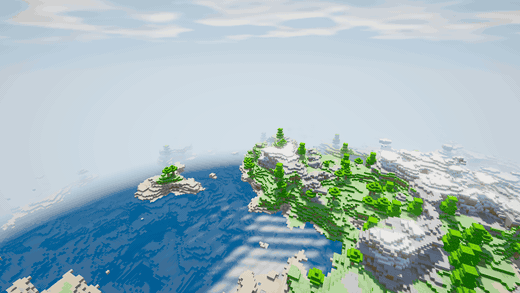
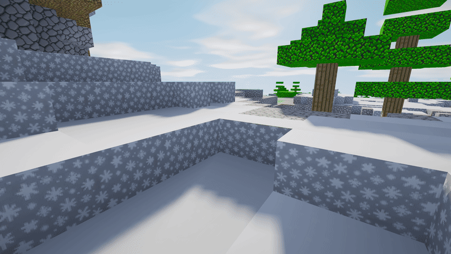
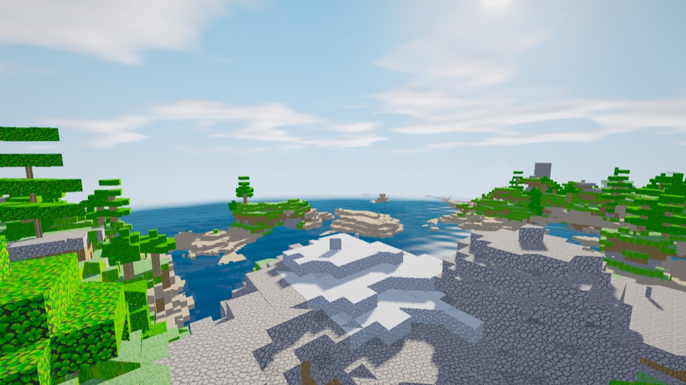
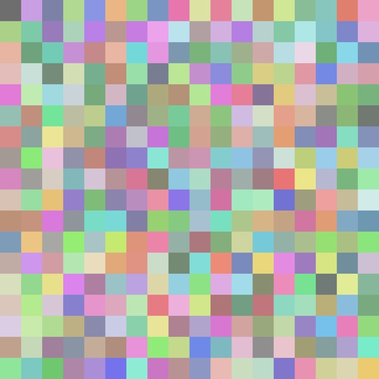
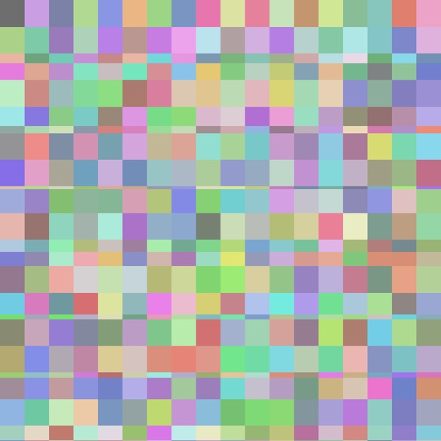
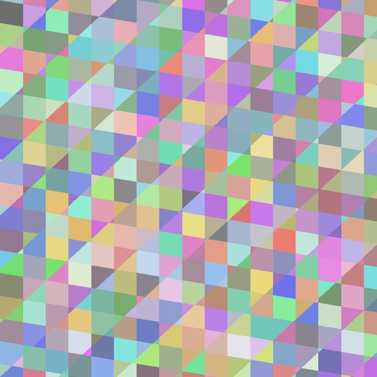
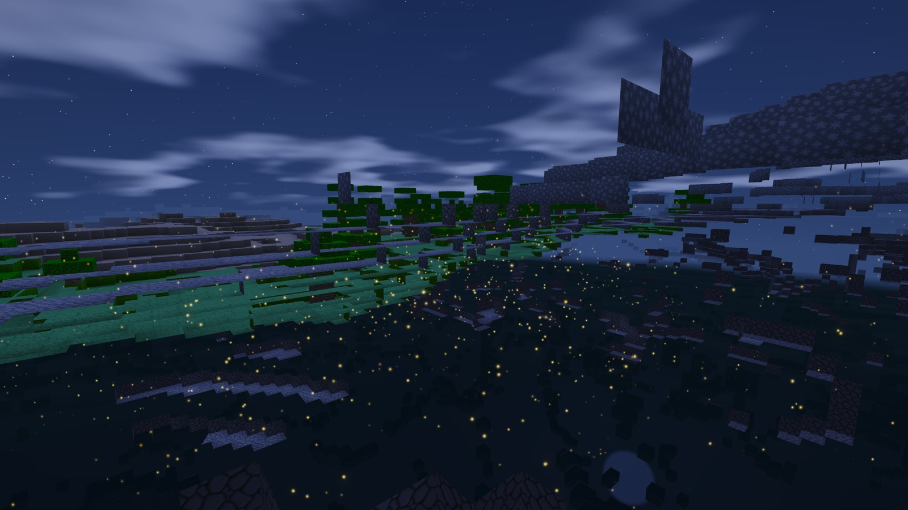
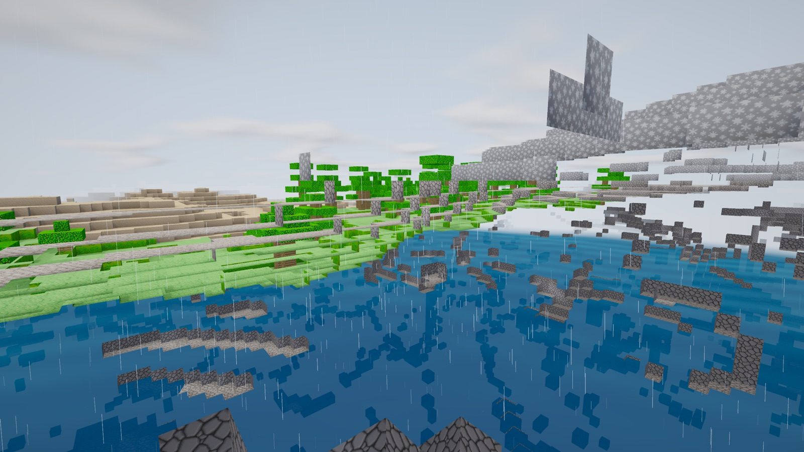

# voxel-engine

[](https://github.com/DanielWLiu07/voxel-engine/actions/workflows/ci.yml)

A voxel engine in C++20 and OpenGL 4.1, written solo. The world has four
spatial dimensions. What you walk around in is a three-dimensional
cross-section of it, and you can turn the cut.



The camera is locked in that clip. Nothing moves except the hyperplane
the slice is cut on, and the landscape rebuilds itself because you are
looking at a different cross-section of the same fixed world.

## Blocks are cross-sections, not cubes



Same world, same cut, same camera. Only the block shape changes, and `P`
toggles it live. The right angles in the first frame are square because a
cube says so; the obtuse corners in the second are where the hyperplane
actually cut the block.

A boulder is a 4-ball, so the slice takes a sphere out of it with radius
`sqrt(r² - d²)`. Travel along the fourth axis and it swells, peaks, and
vanishes. A monolith is a 4-box, so turning the cut takes its footprint
from a rectangle to a hexagon.



## Greedy meshing works in four dimensions

The mesher's own design notes said this geometry could not be
greedy-meshed. Neighbouring cells present their polygons at different
angles, so no two faces line up to be merged.

That is true of the polygons and false of the conclusion.

The preimage of a convex set under a linear map is convex. `to_4d` is
linear and a lattice box is convex, so a **box** of cells presents one
convex polygon at any angle. Greedy meshing works on a tilted cut. It
just has to sweep in lattice space rather than slice space.

| cut | before merging | after |
|---|---|---|
| flat | 2.47x greedy | **1.41x** |
| ZW only | 3.45x | **1.96x** |
| both planes | 4.97x | **3.05x** |
| hard tilt | 4.98x | **3.58x** |

<p align="center">
  
  
  
</p>

Left to right: no tilt, one rotation plane, both. A cut turned in a
single plane presents four-sided cells at every angle, so a cube is exact
there and not an approximation. Only a compound turn makes pentagons and
hexagons.

The gap that is left is not slack. Re-merging in a third dimension
recovers about 1% of the quads at any cut, measured in
[docs/bench/merge-headroom.md](docs/bench/merge-headroom.md) after the
design notes claimed otherwise. A turned hyperplane simply meets more
cells, and each one brings its own edges.

## The numbers

These are ratios and byte counts, so they reproduce anywhere. CI runs
`--bench` three times and requires byte-identical output; the x86-64
Ubuntu runner emits the same bytes as the arm64 M4 this was built on.

| | |
| :--- | ---: |
| Greedy meshing vs naive per-face | **5.3x fewer** triangles, CI-gated at 4.5x |
| Vertex format, packed vs float | 40 B to **12 B** |
| Whole-world GPU mesh, all three wins | 126.7 MB to **10.9 MB**, 11.6x |
| Index data per chunk | **zero**, one shared quad buffer |
| Chunk serialization, RLE vs raw | 39.06 MB to 0.67 MB, **58x** |
| Sub-chunks drawn vs loaded, underground | up to **70x fewer** |

Frame times are a different kind of number. They belong to one laptop,
so they are quoted here as the mean of four runs on an Apple M4:

| | radius | voxels | triangles | frame | inside 60 Hz |
|---|---:|---:|---:|---:|---:|
| cubes | 32 | **277 M** | 988,436 | 8.2 ms | **2.0x** |
| cubes | 16 | 71 M | 260,018 | 5.1 ms | **3.3x** |
| 4D cross-sections | 16 | 71 M | 470,810 | 6.4 ms | **2.6x** |

276,889,600 voxels across 4,225 chunks is the largest world tested.
`--validate --radius 32` reads every mesh back off the GPU and reports
`bad_triangles=0`, so that is correct geometry and not just a fast
number. Terrain generation and meshing run on nine workers; every GL
call stays on the main thread.

The millisecond column moves with machine load. The triangle and byte
columns beside it never move, which is why the CI gates are on those and
not on the clock.

Full sweeps, pass breakdowns, and the reasoning behind each gate:
[docs/performance.md](docs/performance.md).

<p align="center">
  
  
</p>

The same terrain meshed both ways, in wireframe. Left is one quad per
block face; right is the same surface after coplanar faces merge.

## What it looks like



    ./build/voxel_engine --3d --pose-at 18,40,18,-140,-8 \
        --time-of-day 0.82 --radius 8 --screenshot-after 100

Fireflies drift through the trees after dark and thin to faint dust by
day. They have no vertex buffer and no CPU state at all: the shader
derives every position from `gl_VertexID` and the clock, so nine thousand
of them are one draw call and nothing to keep in sync. Leaves sway in the
same breeze, and the shadow pass applies the same offset, or a canopy's
shadow would stay where the canopy no longer is.



    ./build/voxel_engine --3d --pose-at 18,40,18,-140,-8 \
        --time-of-day 0.40 --radius 8 --weather 0.85 --screenshot-after 100

Weather comes and goes on its own - dry most of the time, with spells of
rain below the snow line and snow above it. It is a lighting change
first: the sun drops, shadows soften toward none, and the sky and its fog
grey over. The first version left the sun blazing and the drops were
invisible, which is the whole lesson. `--weather 0..1` pins it, because a
capture pins the clock the cycle is read from.

<p align="center">
  
  
</p>
<p align="center">
  
  
</p>

Cascaded shadow maps, a bloom pyramid over an HDR target, per-block light
that floods out from a placed Glow block, and a sky drawn entirely in a
fragment shader - hashed starfield, a moon riding the sun's own arc, and
a cloud deck that goes slate after dark.

Every still here regenerates from a command. Pose, seed, and hour are all
arguments, which is the only reason the captions can carry them.

## Build

```
cmake -B build -G Ninja
cmake --build build -j
./build/voxel_engine
```

Needs CMake 3.20+, Ninja, and a C++20 compiler (Clang 15+, GCC 12+, MSVC
19.3+). The first configure takes about two minutes while FetchContent
clones GLFW, GLM, and Dear ImGui. macOS is the primary target; Linux and
Windows build clean on CI.

```
./build/voxel_engine --bench          # mesher and cull benchmark, no window
./build/voxel_engine --validate       # read meshes back off the GPU and check them
./build/voxel_engine --slice-prisms   # blocks as 4D cross-sections
./build/voxel_engine --3d             # the ordinary three-dimensional world
./build/voxel_engine --wind 0         # still air; 1 is the default breeze
./build/voxel_engine --motes 0        # no fireflies or dust
./build/voxel_engine --weather 0.9    # pin a downpour; omit for the natural cycle
```

## Controls

| Key | Action |
| --- | --- |
| WASD, Space, Left Ctrl | Move, up, down |
| Left Shift | Sprint |
| F | Toggle walk / fly |
| Left / right click | Break / place block |
| 1-8 | Pick block (Glow is a light source) |
| Tab, F2, F12 | Mouse capture, HUD, screenshot |
| F5 / F6 | Save / load `./saves/world1/` |
| T, `[`, `]` | Pause and step time of day |
| O, V, Esc | Occlusion culling, vsync, quit |

Four-dimensional controls:

| Key | Action |
| --- | --- |
| **Mouse wheel** | Turn the cut in the ZW plane. This is the one that reshapes the world. |
| **E / Q** | Travel along w, the fourth axis |
| Hold M or middle mouse | The mouse turns the cut: vertical is ZW, horizontal is XW |
| P | Draw blocks as their 4D cross-section instead of as cubes |

Walking does not morph the world, at any tilt, and neither does it in 4D
Miner. Your slice is a fixed hyperplane and WASD moves you within it. The
wheel is what turns the cut.

## How it is checked

The engine is the thing being measured, so most of the work went into
making the measurements hard to fake.

- **Nine test binaries** run by ctest, including a differential fuzz that
  decomposes every quad from the greedy and naive meshers back into unit
  faces and compares them as sets, over 180 fill x neighbour x seed cases
- **20 four-dimensional invariants** in `--verify-4d`, among them a
  byte-identical rotation round-trip: turn the cut 0.25 rad and back, and
  every byte of the world has to return
- **Byte-identity gates.** `check_invariance.py` runs `--bench` three
  times and requires identical output, on both CI platforms
- **A registration guard.** `check_test_targets.py` compares the tests
  that actually registered against a written-down list, after an unclosed
  `if(APPLE)` once left Linux running six tests of eight and reporting
  100% passed
- **Conventional Commits**, checked on every pull request by
  `check_commit_messages.py`. Its rules were derived from this repo's own
  311 commits rather than copied off the spec, so the two that would have
  rejected a quarter of that history are deliberately not enforced
- **TSan and ASan/UBSan** over the full logic suite in CI
- `--validate` reads meshes back off the GPU and checks every triangle
  against the voxel data that produced it

## Reading further

| | |
| --- | --- |
| [docs/how-it-works.md](docs/how-it-works.md) | How the engine works, from scratch - start here if graphics is new to you |
| [docs/cross-section.md](docs/cross-section.md) | How the cross-section works, with pictures |
| [docs/atmosphere.md](docs/atmosphere.md) | Wind, fireflies, weather, birds, mist - one idea used five times |
| [docs/4d.md](docs/4d.md) | The engineering log: what broke, and what it cost |
| [docs/performance.md](docs/performance.md) | Every measurement, with its command |
| [docs/design.md](docs/design.md) | Architecture and layering |
| [docs/bench/](docs/bench/) | Benchmark artifacts and inputs |

## What is in here

```
src/core/     Window, input, timing, thread pool, CLI, frame stats
src/gfx/      Shader, texture, mesh, camera, shadows, post-process, water
src/world/    Blocks, chunks, meshers, 4D terrain, the cross-section kernel
src/render/   Lighting and the shadow / sky / terrain / water passes
src/game/     Player, physics, block interaction
src/ui/       Debug HUD
src/bench/    Headless benchmarks
```

`gfx/` knows nothing about voxels. `world/` owns voxel data and meshing
and never reaches into gameplay. `game/` is the only layer that
coordinates world, player, and input. Chunk generation and meshing run on
a worker pool; GL calls run on the main thread only.

---

Block textures are AI-generated and disclosed in [TEXTURES.md](TEXTURES.md).
