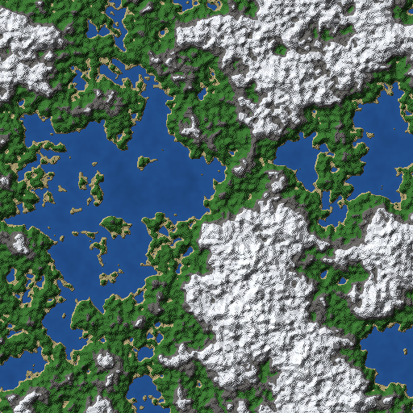
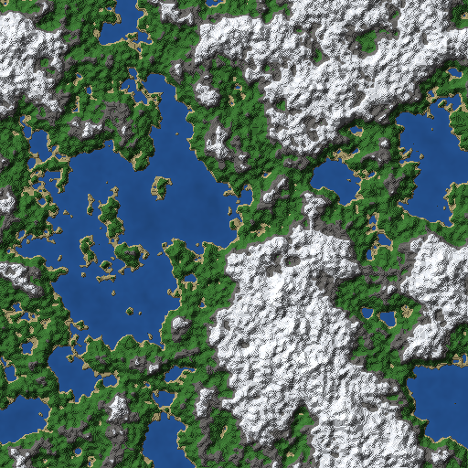
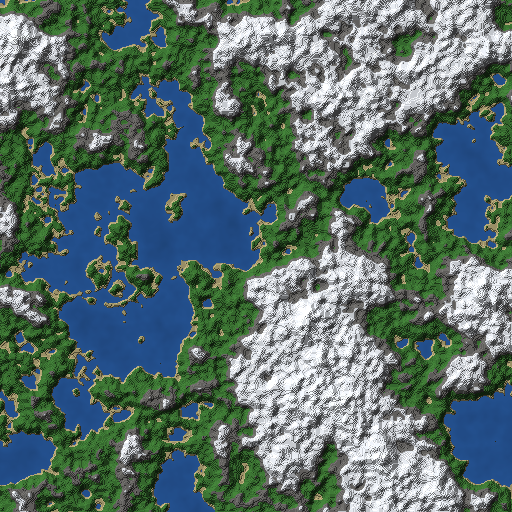

# A fourth spatial axis: does it work?

Phase 0 of taking this engine to four dimensions. Not the engine work -
this is the question that decides whether the engine work is worth doing,
answered in a day rather than discovered in week four.

## The question

You cannot draw four dimensions on a screen. The practical approach is to
render a 3D hyperplane slice at the player's current `w`, so moving along
the fourth axis swaps which slice you see and the world appears to morph.

That only means something if the slices are related. If `w` and `w+1` are
unrelated worlds, the fourth dimension is a seed change with extra steps:
you would not be moving through anything, you would be teleporting between
random worlds, and no amount of engine work fixes that.

So: **does a step along `w` morph the world coherently?**

## The answer: yes

<table>
<tr>
<td> <b>w = 0</b></td>
<td> <b>w = 1</b>, one step</td>
<td> <b>w = 8</b>, eight steps</td>
</tr>
</table>

One step keeps the world: the same ocean, the same island chain, the same
mountain mass in the south east, with coastlines redrawn and lakes opened
and closed. Eight steps is somewhere else entirely - highland lakes rather
than ocean and islands - and it got there continuously, never by jumping.

That is what a spatial axis is supposed to do, and it is the finding that
makes the rest of the 4D work worth starting.

Regenerate with:

    cmake --build build --target slice4d
    ./build/slice4d              # seed 1337, 24 slices into docs/media/slice4d

## What it cost to find out

Two things had to exist first.

**4D noise, because FastNoiseLite stops at three arguments.** It exposes
`GetNoise(x, y)` and `GetNoise(x, y, z)` and nothing else, so the noise is
the one part of a 4D terrain generator that cannot be reused and has to be
written. `src/world/noise4d.cpp` is 4D gradient (Perlin) noise: 16
hypercube corners, 32 gradients, quintic fade, quadrilinear interpolation.

**A harness that renders slices**, `src/bench/slice4d.cpp`, which is where
the two findings below came from.

## Two things the harness found

**1. The fourth axis needs its own scale.**

With `w` treated exactly like `x` and `z`, a step along it changed 4.6% of
columns by at most one block. The world was frozen along `w`.

That is not a bug. The continent field runs at frequency 0.004, so one
noise cell is 250 units wide, and a player who can walk 250 units along
`x` cannot walk 250 units along `w` - there is nothing there to walk
through. Measured over 24 slices:

| `w` scale | columns changed per step | max column jump |
| --- | --- | --- |
| 1 | 4.6% | 1 |
| 5 | 51.2% | 4 |
| 25 | 77.3% | 9 |
| 60 | 85.0% | 11 |

The max jump staying in single digits across all of these is the important
row, because it says the field is continuous along `w` at every scale.
Choosing 6 is a decision about feel, not about correctness.

**2. The 3D generator's height formula does not transfer.**

Dropping the composite noise into `kSeaLevel + n * 28 + 14`, which is what
`terrain_gen.cpp` uses, put every column between y=31 and y=46. No water
anywhere, and the whole world inside the grass/stone/snow bands. The first
render was a blob map for exactly that reason.

The cause is that this `fbm` normalizes by the amplitude sum and
FastNoiseLite's does not, so the composite here measures p1..p99 of
-0.17..0.21 rather than filling `[-1, 1]`. Refitted to the measured
distribution, `n * 115 + 8` spreads the world across roughly y=12..56 with
about a fifth of it under sea level.

Worth recording because it is the shape of what the rest of the 4D work
will look like: the algorithms port, the constants do not.

## What is verified

`tests/test_noise4d.cpp`, 32 checks, run by ctest. The properties, not the
outputs:

- exactly zero at every integer lattice point (an identity, not a
  tolerance), and alive between them
- pure, seed-stable, and responsive to the seed, including at seed 0 and
  seed `UINT32_MAX`
- inside `[-1, 1]`, and actually using that range
- C1 across cell boundaries: the slope does not jump
- C2 across cell boundaries: the curvature does not jump either, which is
  what separates the quintic fade from the cubic one
- isotropic: no axis moves the field faster than another, `w` included
- a fixed `w` gives a usable 3D field, and distant `w` gives a different one

Fifteen faults were injected to check the tests are not decoration. All
fifteen fail a named check. Three of them fail at compile time, because a
gradient table with a zero, duplicated, or over-long row shifts the field's
standard deviation by 1.6% - too small to gate on without a brittle bound,
so the property is asserted structurally instead:

    static_assert(grad4_table_is_well_formed(), ...)

The two that needed the most work are the interesting ones. Dropping `w`
from the gradient dot product survives every value, range and continuity
check, because the hash still varies with `w` and the interpolation still
runs along it - the field still responds to `w`, it just degrades to value
noise on that one axis. The isotropy test catches it: the ratio between
the fastest and slowest axis is 1.004-1.015 on correct noise and
1.58-1.60 with `w` zeroed. And swapping the quintic fade for Perlin's
original cubic passes everything except the C2 check, where the
one-sided second-derivative mismatch goes from 1.13-1.28 to 11.3-12.1.

## The generator, and what the fourth dimension costs

`src/world/terrain_gen4d.cpp` is the 3D generator's structure with `w`
threaded through every sample: domain-warped fBm for height, two
intersecting iso-surfaces for caves, altitude bands for surface material.
The frequencies port unchanged, because a frequency is about feature size
in world units and that does not depend on how many axes there are. The
amplitudes did not port, for the reason above.

29 checks in `tests/test_terrain_gen4d.cpp`, and the two that matter are
the ones that decide whether `w` is a dimension at all: **a slice must be
an ordinary usable world**, and **adjacent slices must be related**. Both
failures are silent - a `w` that does nothing gives a perfectly correct
world with no fourth dimension in it, and a `w` that does too much gives
one that teleports.

### The cost, measured

A step along `w` swaps the entire visible slice, so every chunk's mesh is
invalid. That is the central engineering problem of a 4D voxel engine, and
it does not appear to be published anywhere - games that ship 4D worlds
do not report it.

`src/bench/wcost.cpp` measures it. Radius 6, 169 chunks, single-threaded
on an Apple M4:

    full rebuild per w step: 198 ms  (gen 95 + mesh 103)

The interesting half is what fraction of that is avoidable. Measured at
three granularities, stable across radii 4-8 and three seeds:

| unit | changes per `w` step | if re-meshing could skip the rest |
| --- | --- | --- |
| chunk (today's mesher) | **100%** | 198 ms, 1.00x |
| section (renderer's unit) | **19-24%** | 117 ms, **1.70x** |
| column (theoretical floor) | 92-95% | 191 ms, 1.03x |

**Chunk-granular incremental re-meshing is worth exactly nothing**, and
that was not the expectation going in - it was one of three optimisations
this work set out to try. Every chunk in the window changes on every step,
so there is nothing to skip. The idea is dead at this scale.

Sections are where the headroom is, and column granularity - which sounds
finer and therefore better - is *worse* than sections. The reason is the
same for both, and it is the actual finding: **the fourth dimension mostly
moves the surface.** A section is a 32-block vertical slab, so the ones
deep underground are solid rock at every `w` and the ones high above the
terrain are empty at every `w`; only the few straddling the surface
change. A column spans all 256 blocks, so if any part of it moves the
whole column counts as changed, and nearly every column has something
moving somewhere.

That is actionable rather than a curiosity: a 4D engine should mesh at
section granularity, not chunk granularity. Today's mesher builds a
chunk-wide mesh and then buckets it into sections, so this is a real
redesign and not a tuning knob - but it is now a redesign with a number
attached.

    cmake --build build --target wcost && ./build/wcost 6

### How far the world goes

Coordinates are floats and a float carries 24 bits of mantissa, so past a
point two nearby world positions round to the same float and the noise
returns the same value for both. The terrain does not error when that
happens. It goes flat, which is the quietest failure a world advertising
no bounds could have. Measured over 2000 samples half a unit apart:

| distance from origin | distinct samples |
| --- | --- |
| 1e2 to 1e6 | 2000 / 2000 |
| 1e7 | 998 / 2000 |
| 1e8 | **1 / 2000** |

So the usable range is about a million world units, which is 62,500 chunks
from the origin - far past anywhere a player reaches, and now a written
limit rather than something to be discovered later as "the terrain went
flat out there". `test_the_field_keeps_its_detail_out_to_a_million_units`
pins it, and pushing that test to 1e8 fails it, which is how the bound is
known to be real rather than decorative.

This is not specific to the 4D work: the 3D generator uses FastNoiseLite,
whose coordinates are also float by default, so it shares the ceiling.
Nothing returns NaN or infinity at any magnitude or sign - it degrades
rather than exploding, and there is a test for that too, because a NaN
would pass straight through the height clamp (NaN compares false against
both bounds) and into chunk contents.

## What this does not do yet

Nothing in the *engine* is 4D. There is a 4D noise field, a 4D terrain
generator, a slice harness, a cost model and an answer - but the engine
still stores 3D chunks, meshes them in 3D and renders them in 3D, and
every existing number is unchanged: `--validate` still reports
`gpu_mesh_mb=10.99`, and `check_invariance.py` still passes.

The scoping that follows from the answer:

| stays 3D | goes 4D |
| --- | --- |
| greedy mesher | chunk storage, indexed `(cx, cz, cw)` |
| frustum culler | terrain generation |
| occlusion graph | streaming window |
| shadow, HDR, sky, water | player position and controls |
| vertex packing | |

Because only the current slice needs GPU meshes, `gpu_mesh_mb` would
survive. CPU residency would not: keeping `w ± 2` loaded is 3,125 chunk
slots at 96.4 KB each, about 294 MB against today's 58.8 MB.

The open engineering problem is `w` traversal, and it now has numbers
rather than a guess: 198 ms single-threaded per step at radius 6, about
22 ms across nine workers, and 13 ms if meshing moved to section
granularity.

Of the three approaches this work set out to measure, one is now ruled
out. What remains: **section-granular re-meshing** (1.70x, and the
renderer already culls at that unit), **greedy meshing extended to merge
along `w`** so re-slicing becomes a query rather than a rebuild, and **an
LRU of slice meshes**, trading GPU memory for smoothness.
