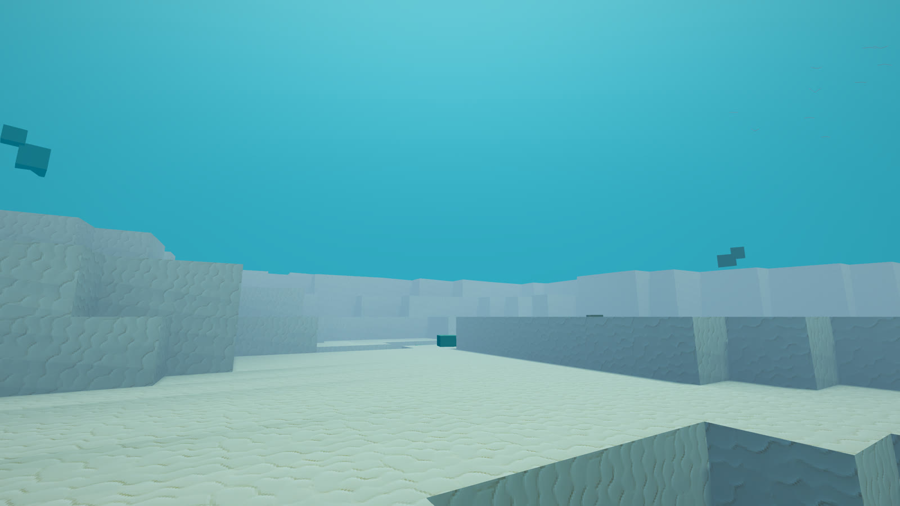
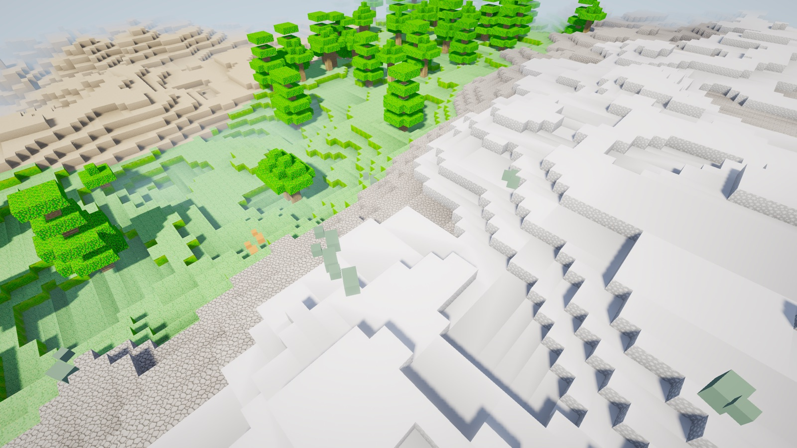
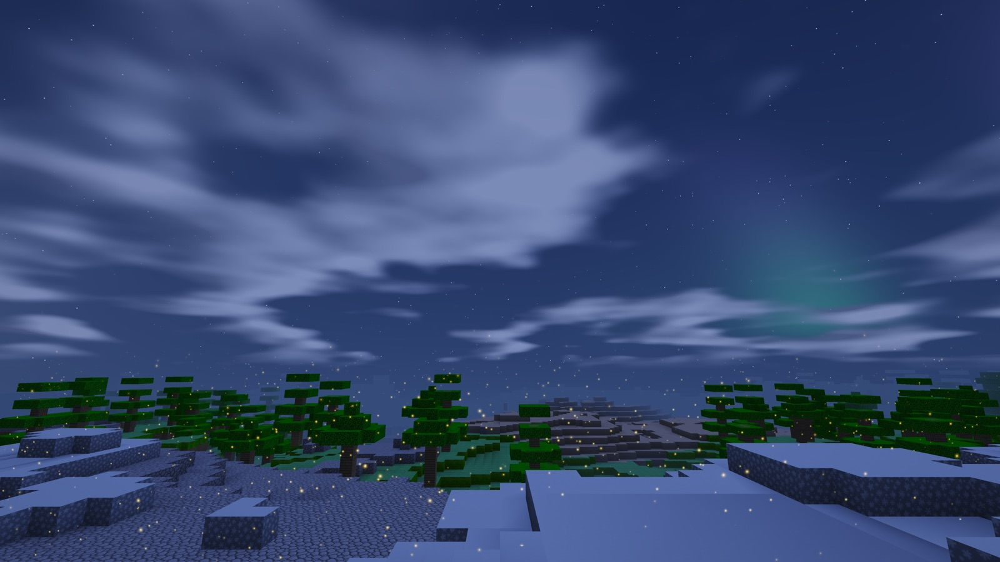
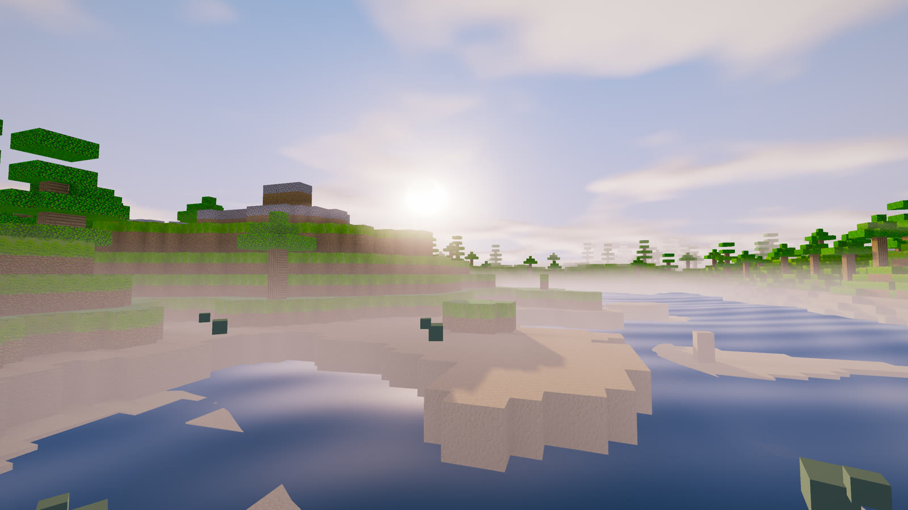

# The atmosphere

Five effects make the world feel lived in: foliage that moves, fireflies
and dust, rain and snow, birds, and mist pooling in the valleys. None of
them own a vertex buffer, none hold state, and together they cost about
a tenth of the instrumented pass time.

This is how, and what looking at the renders taught that reasoning about
them did not.

## Leaves, butterflies, meteors, the bow, and rain on water

Five later additions, all on the same plan as the rest of this document:
the position is a function of a seed and the clock, there is no buffer to
fill, and the CPU never touches one.

**Leaves** fall rather than drift, so the wrap has to run along the
direction of travel - subtracting from y before the mod is what keeps the
column continuous, and per-leaf fall speeds stop them dropping as a sheet.
The sideways motion is two sines at different rates, which is what makes
it read as a leaf slipping and stalling rather than as rain. The point
sprite is cut to a spinning lens in the fragment stage, because a leaf
that stays a disc all the way down reads as orange snow.

**Butterflies** are the daytime answer to the fireflies, which go to pale
dust by day on purpose and left the daylit world with no small moving life
in it. Six vertices each: two triangles hinged about the body's forward
axis so the wings actually beat. The first version drew what those
vertices literally describe - hard-cornered wedges meeting at a point -
and it read as a paper plane. The wing is cut to a rounded shape in the
fragment stage instead, with a dark margin just inside the edge, which is
what the eye reads as "wing" rather than "triangle".

Count is the other thing that needed a second look: 44 of them put exactly
ONE butterfly in a 1440p frame, because the slab is centred on the camera
and half of it is inside the hill the camera is standing on. Those are
correctly hidden by the depth test. 130 puts a dozen in frame.

**Meteors** cut time into slices and seed the streak from the slice index,
so "which meteor" is a function of the clock rather than state that has to
be spawned and retired, and only about a third of slices carry one. The
period is 3.55 s rather than a round 3.5 for a reason worth writing down:
scripted captures pin the clock to exactly 100.0 so frames stay diffable,
and 100/3.5 lands between streaks, so a still could never show one and
nothing could test it. 100/3.55 lands mid-flight.

**The bow** is geometry, not decoration. It is a ring 42 degrees off the
antisolar point, so it is drawn against that direction and rises as the
sun sets without anything placing it. Each channel gets its own angle -
42.4 red, 41.3 green, 40.1 blue - and the secondary at ~51 degrees comes
out with its colours reversed for free. Summing one white gaussian and
tinting it, which is what this did first, adds the same light to all three
channels and renders a WHITE arc: the shape was right and the physics was
missing.

**Rain rings** on the water are a grid where most cells are empty. The
first version gave every cell a ring every cycle and the lake came out
looking like bubble wrap - a regular lattice of identical circles, the one
thing falling rain never produces. A second hash seeded by the cell and
the cycle index decides whether a cell fires at all, and the impact point
is jittered inside it.

Measured against the same build with them off, interleaved, three runs
each on an M4: the atmosphere pass goes 0.91 to 1.08 ms with leaves and
butterflies on. The rain rings add 0.03 ms to the water pass, which is
inside the run-to-run spread. The meteor and the bow are branch-guarded to
night and to rain, so a default daytime frame pays nothing for either.

## The stills

Every one regenerates from the command beneath it.



    ./build/voxel_engine --pose-at 300,22,-420,-60,10 --time-of-day 0.45 \
        --radius 10 --screenshot-after 150


    ./build/voxel_engine --3d --pose-at 18,40,18,-140,-8 \
        --time-of-day 0.82 --radius 8 --screenshot-after 100



    ./build/voxel_engine --3d --pose-at 20,58,20,-135,-45 \
        --radius 8 --time-of-day 0.35 --screenshot-after 120

Creatures wander the terrain too, in two kinds: orange hoppers that
bounce and green striders that amble. They read the ground height under
themselves and walk over hills rather than through them, and when the 4D
cut turns and the land beneath them becomes a different landscape, they
step onto the new one.

Eight effects share that one idea, and each has a scale with 0 to turn it
off: foliage that sways (the shadow pass applies the same offset, or a
canopy's shadow stays where the canopy no longer is), fireflies at night
thinning to dust by day, rain and snow, mist pooling in the valleys,
flocks circling overhead, the aurora, and clouds dappling the ground as
they pass. Together they cost about a tenth of the instrumented pass
time - measured, not assumed:
the sections below.



    ./build/voxel_engine --3d --pose-at 30,46,30,180,12 \
        --time-of-day 0.84 --radius 8 --screenshot-after 100

Aurora curtains, a hashed starfield, a cloud deck gone slate, and
fireflies over the trees - all in one frame and none of it geometry. The
aurora is a handful of sines on the view direction inside the sky shader;
the fireflies derive every position from `gl_VertexID` and the clock, so
nine thousand of them are one draw call with no CPU work and nothing to
keep in sync.


    ./build/voxel_engine --3d --pose-at 18,40,18,-140,-8 \
        --time-of-day 0.40 --radius 8 --weather 0.85 --screenshot-after 100

Weather comes and goes on its own - dry most of the time, with spells of
rain below the snow line and snow above it. It is a lighting change
first: the sun drops, shadows soften toward none, and the sky and its fog
grey over. The first version left the sun blazing and the drops were
invisible, which is the whole lesson. `--weather 0..1` pins it, because a
capture pins the clock the cycle is read from.


## One idea, used five times

A particle system usually means an array: spawn, update, retire, upload.
That is CPU work every frame, state to keep in sync with a reloaded
world, and a buffer to manage.

None of that is here. `gl_VertexID` is the particle's seed, and the
vertex shader derives its whole position from that seed and the clock:

```glsl
float drop = float(gl_VertexID >> 2);   // which bird
vec3  r    = h3(drop);                  // its fixed random numbers
vec3  pos  = f(r, u_time);              // where it is, right now
```

What that buys:

- **One draw call each.** 9,000 motes, 7,000 raindrops, 60 birds.
- **No CPU cost at all.** There is no array to walk.
- **Nothing to get out of sync.** Load a save, travel along the fourth
  axis, rotate the slice: the field is a function, so it is simply
  correct afterwards.
- **Captures reproduce.** Position is a pure function of seed and time,
  and scripted captures already pin the clock at 100.0 for the water
  phase. Every still in the README reproduces byte for byte from the
  command in its caption, atmosphere included.

### The volume follows you, and nothing respawns

Each particle owns a fixed point in a repeating box. The box is
re-centred on the camera every frame with a `mod`, so walking forward
wraps the ones behind you around to the front:

```glsl
vec3 rel   = mod(base - centre + u_box, u_box * 2.0) - u_box;
vec3 world = centre + rel;
```

The field is therefore infinite without anything ever being spawned or
retired, and particles fade near the box edge, which is what hides the
wrap.

## What each one needed, which was not obvious

**Wind.** Leaves only - a swaying ground block tears the terrain open and
a trunk that moves with its canopy slides out of the ground. The offset
is a function of world position, so two vertices at the same point move
together and no seam opens along a greedy-merged quad. The shadow pass
applies the same offset; without it the canopy's shadow stays where the
canopy no longer is, which is more obviously wrong than no sway at all.

**Fireflies.** The first density was 3,000 across a 96 m cube - one per
295 cubic metres, invisible. And a cube centred on the camera puts half
the swarm above the horizon, where it reads as noise against the sky. The
volume is a wide flat slab centred three metres below the eye, with the
ones still overhead dimmed hard. That is the difference between stars and
fireflies in the trees.

**Weather is a lighting change first.** This is the one worth taking
away. The first version left the lighting alone and put white flakes over
a white snowfield at noon; they were invisible, and rain against a lit
blue sky was barely there either. Particles alone do not read as weather.
The sun drops 60%, shadows soften toward none, and the sky and its fog
grey over - and then the drops are visible, because there is something
for them to be visible against.

**Birds** are drawn as a V of two line segments, built in the camera's
plane rather than the world's. A bird oriented in world space turns
edge-on twice an orbit, and at this size that is a flicker, not a bank.
They fly in flocks of twelve around a shared centre, because sixty evenly
salted specks do not read as birds. The first wingspan was 0.3 m, which
is a one-pixel tick at any distance you would see one from.

**Mist needs two terms multiplied**, altitude and depth. Altitude alone
puts a wall of white at your feet; depth alone fogs a mountainside as
hard as the valley beside it. Together the low ground goes milky while
the ridges stay sharp, which is what gives a wide view layers.

**Cloud shadows multiply the sun and never the ambient.** A cloud
overhead darkens the direct light and leaves the sky light it scatters,
so shaded ground still reads blue instead of going flat grey. That one is
physics rather than taste.

## What it costs

From `--bench-frame N --pass-breakdown`, radius 12, M4:

```
shadow 2.71   sky 2.30   terrain 3.39   water 1.95   atmos 1.85   postfx 6.41
```

About a tenth of the instrumented pass time, in the same band as the
water pass. Not free.

Two notes on reading that. The breakdown brackets each pass with
`glFinish`, so it serializes work the real frame overlaps and reports an
upper bound per pass - it attributes cost between passes and is the wrong
tool for quoting a frame time. And a blunt whole-frame A/B could not
resolve this at all: three interleaved rounds with everything on gave
8.51/8.93/10.03 ms against 8.42/9.05/10.27 off, with two of three rounds
showing the version doing *more* work as faster. The machine drifted
further across the rounds than the feature moved the frame.

## Light and water

Three things that are all the same observation: the engine knew what hour
it was everywhere except where it mattered most.



    ./build/voxel_engine --pose-at 300,30,-300,-108,3 --time-of-day 0.728 \
        --godrays 1.4 --radius 12 --screenshot-after 150

**Water reflects the sky it is under.** It used to lerp between two
authored colours - a deep blue body and a fixed sky-cyan at glancing
angles - both scaled down by the day cycle. That is right at noon and
wrong at every other hour, and the failure was documented rather than
fixed: the capture notes told photographers to raise the sun for lake
shots, because at sunset a peach sky sat over a navy lake. Now the
glancing term is the sky evaluated along the reflection vector, so the
water is gold at dusk, blue at noon, and dark with a moon path at night
without anything being authored per hour.

Two details carry it. The reflection is split into a gradient and a
glitter term, and only the gradient picks up the water's own hue - the
first version tinted both, and since the body colour is
`(0.15, 0.42, 0.60)` it multiplied the red channel of a sunset by 0.33,
deleting the one thing on a lake at that hour anybody would name. And the
sky is sampled analytically, not from the sky pass: the gradient and the
two light discs, but no clouds, stars or aurora, because those are high
frequency and the surface they would land on is moving.

**Shafts, from a threshold that moves with the sky.** `--godrays S` marches
each pixel toward the sun's screen position over the resolved scene,
accumulating what is brighter than the sky itself. Two thresholds failed
before that one, in opposite directions and both instructive: reusing the
bloom's bright-extract thresholds at 1.0, where nothing but the sun's disc
clears it, and the march smeared a few hundred pixels into a halo worth
0.097/255 against the frame with the pass off; a fixed 0.42 makes the
*entire* sky an emitter, so every pixel picks up the same wash and the
frame went milky corner to corner with no shafts in it. Crepuscular rays
need the emitter to be mostly black. The threshold is now handed in from
the CPU as 1.12x the brighter end of the sky gradient, which tracks a
cycle whose luma runs 0.05 at night to 0.7 at noon.

**Under the waterline is a different world.** The lake is the biggest
thing in most shots and swimming into it used to render exactly like
standing beside it, sky and all. Now sight closes to 34 m, the distance
fades into water rather than sky, the sky pass draws the underside of the
surface instead of a sunset, and the sunlight itself is attenuated and
blue-shifted before it lights anything - red is the first thing water
takes out, and leaving it in is what makes a submerged shot read as a
tinted photograph rather than as being under water.


    ./build/voxel_engine --pose-at 300,22,-420,-60,10 --time-of-day 0.45 \
        --radius 10 --screenshot-after 150

Water here is one plane drawn at sea level rather than a block - `BlockId`
has no water member, which a first version of the submerged test found
out by failing to compile - so every pocket of air below that plane is
under it by construction, and the camera's height is the whole test.

## What the shafts cost, and why they are off by default

`--godrays` is the one atmosphere flag that defaults to 0, and a
measurement decided it rather than taste:

```
              p50 frame, radius 12, M4, --bench-frame 600
  off         5.0 ms
  on          7.3 ms          +2.30 ms  (range 2.20-2.44, three reps)
```

That is about 45% of the frame, and every perf figure this project
publishes comes off `--bench-frame` and `--bench`. A default-on effect of
that size would silently move all of them, so captures ask for it and
benchmarks never get it by accident.

Getting that number needed an ABBA-paired design - off, on, on, off per
rep - because this machine drifts from 2.5 to 5.0 ms on one unchanged
configuration across a session, and unpaired runs put the *same* build
both faster and slower than itself. Paired, the three reps agreed to
within 0.24 ms.

The same measurement says where the cost is, and it is not where it
looks. Quartering the axes - a sixteenth of the pixels - did not make it
cheaper (+2.15 ms, inside the spread), while cutting the march from 32
taps to 4 took it to +0.98 ms. The cost is the taps into a full-resolution
RGBA16F target, and a smaller output makes those taps land further apart,
trading fewer of them for worse locality. So the pass runs at half res,
because it costs what quarter costs and looks better.

## Turning it off

Every effect has a scale, and 0 disables it:

```
--wind S           foliage sway
--motes S          fireflies at night, dust by day
--weather S        0 clear .. 1 downpour; omit for the natural cycle
--mist S           ground mist in the valleys
--birds S          flocks circling overhead by day
--aurora S         aurora on the night sky
--cloud-shadow S   clouds dappling the ground
--godrays S        sun shafts; DEFAULT 0, see the cost section above
```

`--weather` is an override rather than a scale, and its default is
negative meaning "not given, run the cycle". A scripted capture pins the
clock the cycle is read from, so without the override a still could only
ever show whatever `t = 100` lands on, which is a drizzle of 0.06.
