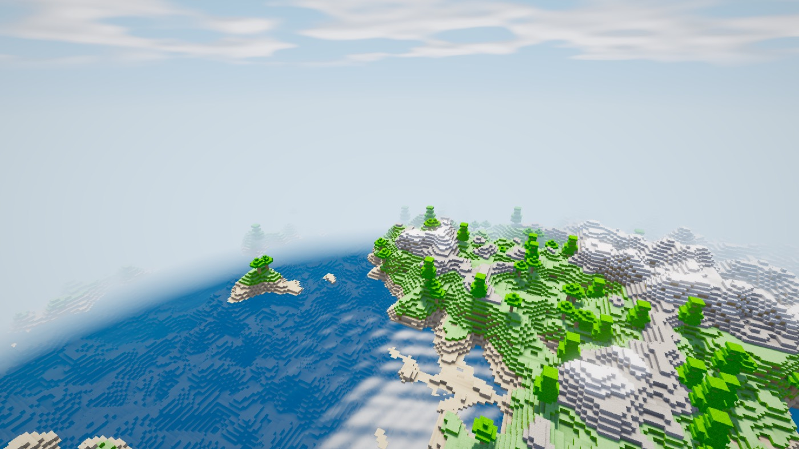
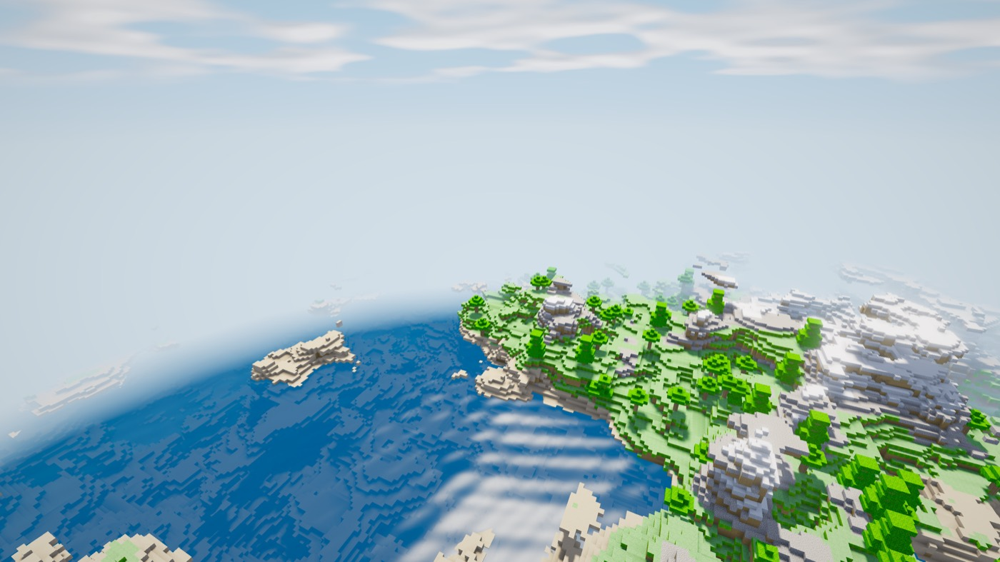
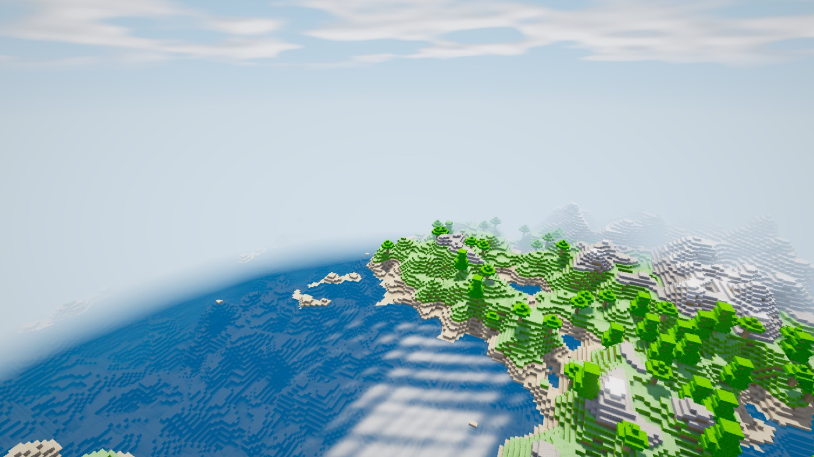
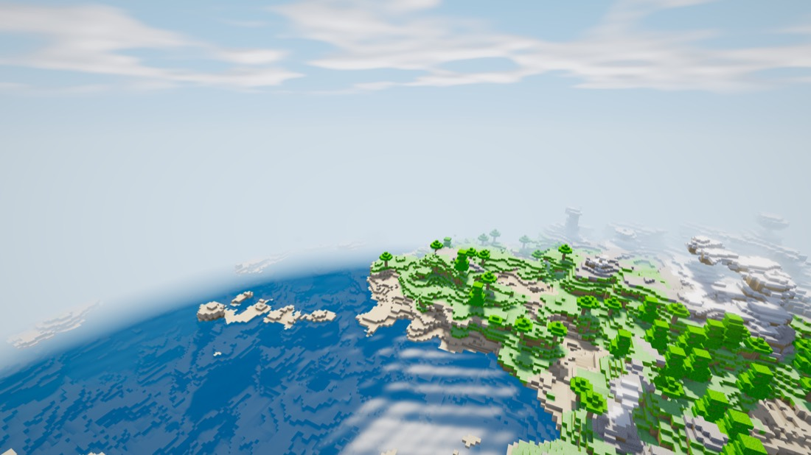
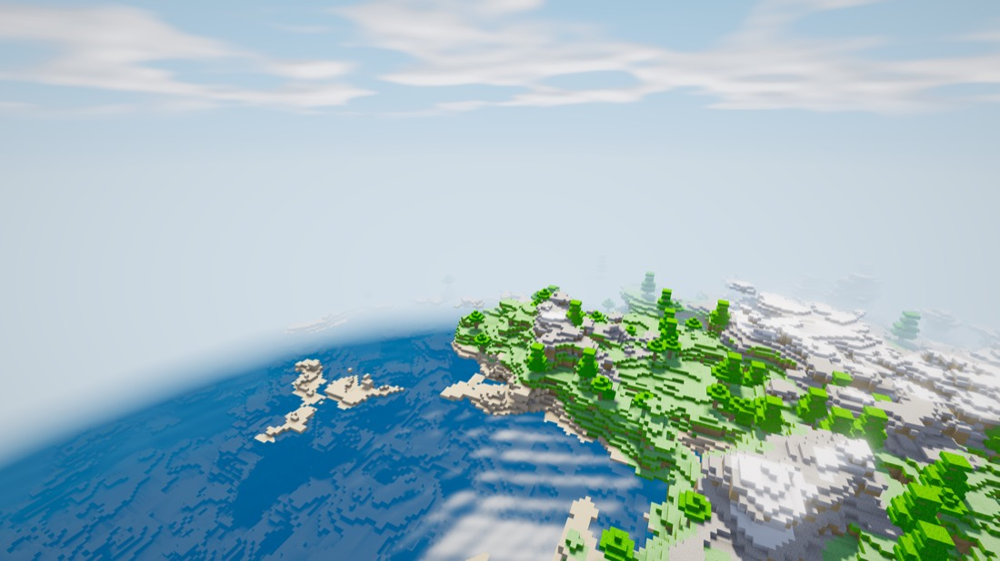
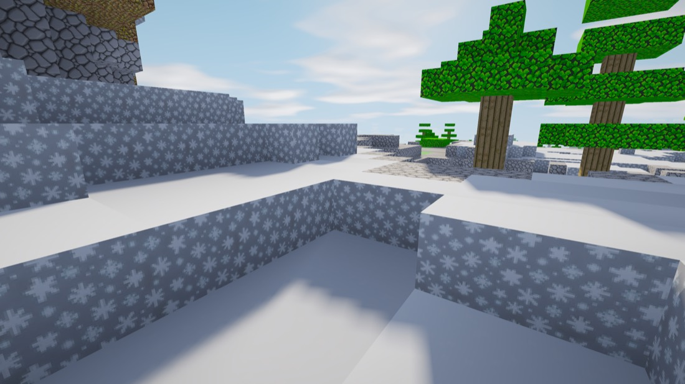
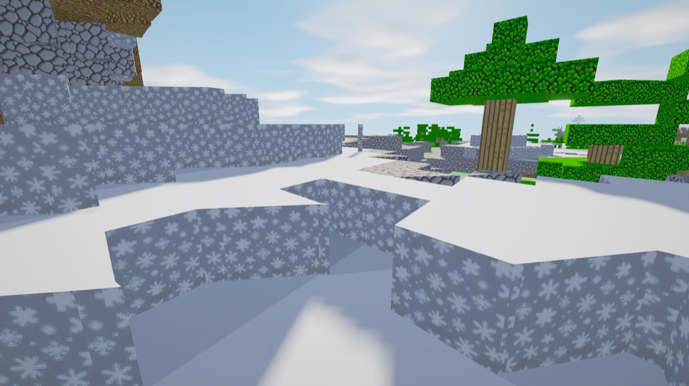
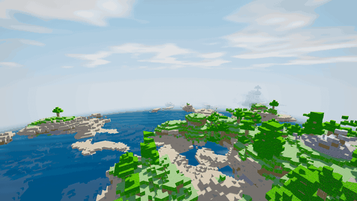

# The cross-section, explained

How a four-dimensional world becomes something you can walk around in,
what a block's cross-section actually is, and why greedy meshing works
on it when the design notes said it could not.

Pictures and reasoning here; the engineering log with everything that
went wrong on the way is in [4d.md](4d.md), and the numbers are in
[performance.md](performance.md).

The engine also runs the world in 4D. `./build/voxel_engine --4d` puts you
in a world generated by 4D Perlin noise, of which the screen shows a 3D
hyperplane slice - and the slice is something you can move.

<table>
<tr>
<td> <b>flat cut</b></td>
<td> <b>tilted 4.3 deg</b>, 85% of columns moved</td>
<td> <b>tilted 8.6 deg</b>, 90%</td>
</tr>
</table>

Look at the rock formations on the right of the third frame, and the
fragment floating over the water. Those are not decoration - they are the
cut entering and leaving the ground down a single column, which is the
one thing a heightfield can never do however you tilt it. The surface is
a **4D density field**: within 20 blocks of the guide height, every voxel
is decided by a fourth-dimensional field rather than by a height.

    ./build/slice4d --shape        # 2451 of 6400 columns (38.3%) have a roof over air

Against 14.5% for the heightfield it replaced - and all of that 14.5% was
the cave pass, none of it the cut.

One camera, one seed, one `w`. The only thing changing between those three
frames is the **angle** of the cut through the 4D world. The coastline
stays recognisable while the snow ridge becomes forest, islands appear
off the point and the shoreline reorganises: a related place seen from a
different angle through the fourth dimension, not a reseeded one.

Three seconds of the wheel, camera locked. Notice where the change is:
the water in the near left barely moves while the middle distance
rearranges itself. That is not an artifact of the clip - the cut turns
about the **viewer**, so the ground under your feet stays put and the
world reorganises around you, which is what makes it read as turning
rather than as teleporting.

    CLIP_TIME_OF_DAY=0.62 scripts/capture_clip.sh tilt

<table>
<tr>
<td> <b>turned 0.15 rad in ZW</b> (the wheel)</td>
<td> <b>turned 0.15 rad in XW</b> (horizontal mouse)</td>
</tr>
</table>

Same camera, same seed, same `w`, same angle - different **plane**. Two
different worlds, and neither is reachable from the other by any amount
of the first rotation. Reproduce with:

    ./build/voxel_engine --4d --seed 1337 --radius 12 --slice-tilt 0.15 \
        --pose-at 20,100,20,-115,-22 --time-of-day 0.62 --screenshot-after 150
    # ... and again with --slice-tilt-xw 0.15 instead

## What a block's cross-section actually is

Looking straight down at the 4D lattice, coloured by which cell each
point of the slice falls into. The boundaries between cells are the block
edges a player sees.

<table>
<tr>
<td> <b>flat cut</b> - squares</td>
<td> <b>ZW only</b> (the wheel) - still rectangles</td>
<td> <b>both planes</b> - triangles, pentagons, hexagons</td>
</tr>
</table>

    ./build/hyperslice --map 0.4 0.4        # writes the third one

This is the geometry behind "the blocks seem to change their shape", and
it settles a question that is easy to get wrong. A cut turned in ONE
plane stays square-on to the two axes it does not turn in, so every cell
is four-sided however far it turns - drawing those blocks as cubes is
**exact**, not an approximation. Only a compound turn produces the
five- and six-sided cells, which extruded in y are the hexagonal pillars
a 4D slicer is known for.

The algebra says the same thing and says why it is cheap: `to_4d` is
linear in (sx, sz) and passes y straight through, so the six constraints
placing a point inside a cell never involve y. A cell's preimage is a
convex polygon extruded through a unit interval - a prism - and six
half-planes bound at most six sides.

## Drawing the cross-section instead of a cube

Knowing the shape is one thing; the renderer emitting it is another.
`--slice-prisms`, or `P` at runtime, draws every block as the polygon its
4D cell presents rather than as a box. Same terrain, same cut, same pose:

<table>
<tr>
<td> <b>cubes</b> - every corner a right angle</td>
<td> <b>cross-sections</b> - the same blocks, cut at the angle you are looking through</td>
</tr>
</table>

    ./build/voxel_engine --slice-prisms --slice-tilt 0.45 --slice-tilt-xw 0.45 \
        --pose-at 22,44,26,-125,-14 --time-of-day 0.7 --screenshot-after 110

The mesher asks the inverted question: not "what is at this voxel" but
"which cells of the 4D lattice does this chunk's footprint pass through,
and what does each look like from here". The answer tiles the footprint
with convex polygons, each extruded through the y axis the rotation never
touches. The voxel grid is then rasterised **from** that tiling, which is
what keeps collision, lighting and the culler working unchanged and
keeps them agreeing with what is drawn - the block you walk into is the
block whose prism you can see.

A cell's contents are a function of `(i, k, l)` and of nothing else, so a
4D block keeps its material while the cut turns through it and only its
shape changes. That is the difference between slicing a world and
re-rolling one, and it is checked: rotate the cut and every cell present
in both tilings must hold the same 256 blocks.

    ./build/hyperslice --mesh          # against the greedy cube mesher, seed 1337

| cut | cells/chunk | prism quads | greedy quads | ratio | prism ms | cube ms |
|---|---|---|---|---|---|---|
| flat | 256 | 21,400 | 15,229 | 1.41x | 2.34 | 2.46 |
| ZW only | 346 | 25,346 | 12,951 | 1.96x | 3.31 | 2.44 |
| both planes | 448 | 45,373 | 14,856 | 3.05x | 4.48 | 2.44 |
| hard tilt | 481 | 61,234 | 17,097 | 3.58x | 5.27 | 2.51 |

256 cells at a flat cut is the voxel grid exactly, and it is gated in the
audit: an untilted 4D cut has to reduce to the cube world block for block,
which is why a cell is sampled at its low corner and not its centre. The
count rises with tilt because a turned hyperplane passes through more
cells per unit of area. The `ms` columns are the whole cost of a chunk on
both paths (terrain plus mesh) on one loaded M4, and they are timings -
the ratios above them are what reproduces elsewhere.

**Greedy meshing works on a tilted cut** - which is not obvious, and this
mesher's own comments used to say it did not. Neighbouring cells present
their own polygons at their own angles, so in slice space there is
nothing for a rectangle sweep to grip. But the preimage of a convex set
under a linear map is convex, `to_4d` is linear, and a lattice box is
convex - so a **box** of cells presents one convex polygon, at any angle
and however many cells it spans. The sweep just has to run over `(i, k)`
of the 4D lattice instead of `(x, z)` of the chunk. At a flat cut the
lattice IS the voxel grid and it reduces to the cube mesher's greedy pass
exactly.

Both horizontal and vertical faces merge that way - a wall's footprint is
just the edge of the merged box that lies on the lattice face it sits on:

| cut | before merging | after |
|---|---|---|
| flat | 2.47x greedy | **1.41x** |
| ZW only | 3.45x | **1.96x** |
| both planes | 4.97x | **3.05x** |
| hard tilt | 4.98x | **3.58x** |

Vertical runs merge for free on top of that - y is the one axis the
rotation never touches, so every cell in a column shares one polygon and
runs of the same block collapse into a single prism exactly.

It does not reach parity with greedy at a flat cut, and the reason is
worth stating rather than rounding off - and worth checking rather than
asserting, because the obvious explanation turned out to be wrong.

The obvious explanation: a merged wall spans one uniform y range, so two
cells whose exposed heights differ never share a quad, where the cube
mesher's sweep splits them into two rectangles and merges what overlaps.
Closing that would need a 3D box decomposition over (two lattice axes,
y) rather than the 2D sweep here.

Measured, that is worth **0.8%**. Dropping the pin on the third
dimension and re-merging in 3D - for walls over `(a, b, y)`, for caps
over `(i, k, l)` - recovers about **1%** of the quads at any cut, and
removing the light term from the grouping entirely does not move it.
The merge is at its optimum; see [docs/bench/merge-headroom.md](bench/merge-headroom.md).

So 1.41x is not slack in the sweep. It is the cut presenting more cells,
each with its own polygon and its own edges - the geometry of a
hyperplane meeting a lattice at an angle, which no sweep recovers.

In the running engine at radius 12, on an M4:

| | GPU mesh | frame | fps | triangles drawn |
|---|---|---|---|---|
| cubes (3D engine) | 10.99 MB | 4.58 ms | 218 | 145,418 |
| cross-sections, flat cut | 19.10 MB | 4.94 ms | 202 | 272,802 |
| cross-sections, both planes at 0.45 | 44.54 MB | 6.04 ms | 166 | 620,856 |

The frame column is the median of three runs each (3D 4.58/4.75/4.57,
flat 4.94/4.92/6.33, tilted 5.97/6.72/6.04) - it is a timing and it moves
with machine load, which is why the spread is printed rather than hidden.
The byte and triangle counts do not.

    ./build/voxel_engine --bench-frame 240 --slice-prisms \
        --slice-tilt 0.45 --slice-tilt-xw 0.45

So the mode costs 4.3x the triangles and 1.3x the frame at a compound
tilt, and still lands 2.8x inside a 60 Hz budget. Those three rows are
timings on one loaded machine; the byte counts and triangle counts above
them are not.

None of the engine's published figures move. This is a separate mesher the
3D engine never enters, and the switch is per chunk rather than per world,
so a window part-way through a toggle draws both kinds correctly - which
`--slice-prisms --validate` checks by flipping the mesher, draining part
of the way, and validating the mixed window it finds.

The cut turns in **two planes**, which is how 4D Miner does it and what
one plane cannot cover: the wheel and vertical mouse turn it in ZW,
horizontal mouse in XW. Hold `M` or the middle mouse button and the mouse
turns the world instead of the camera. One plane alone leaves an axis of
4D orientation unreachable - you can lean the world away from you but
never sideways, and the row you turn about never moves at all.

## Does walking around morph the world?

**No, at any tilt - and that is not a limitation, it is what a hyperplane
is.** Your slice is fixed. Walking moves you *within* it, so terrain
already in view stays exactly as it is and terrain coming into view is
ordinary new terrain, indistinguishable from walking in a 3D world. The
engine makes this structural rather than incidental: staleness is a
function of the chunk and the slice only, so walking cannot mark a single
chunk stale and therefore cannot rebuild anything.

4D Miner is the same. Its wiki: *"the world itself doesn't change when
you walk around - your 3D hyperplane slice stays the same ... the
illusion of change occurs when you rotate your slice."* Rotation is the
control that morphs, in both.

    CLIP_TIME_OF_DAY=0.68 scripts/capture_clip.sh walk

That clip is the **control**, and it is here to be unimpressive. Nothing
in it changes but the camera's position, and the world behaves like any
voxel world. Put it beside a rotation and the difference is the whole
point.

What *is* true about walking a tilted cut is narrower and easy to
oversell - an earlier version of this section did. Your w coordinate does
change, because the slice's own z axis leans into w:

| cut (ZW, XW) | player-w per block walked | blocks per 4D cell crossed |
|---|---|---|
| flat | 0 | never |
| 0.15, 0 (one wheel notch) | 0.025 | 6.7 |
| 0.45, 0 | 0.081 | 2.3 |
| 0.45, 0.45 | 0.089 | 2.3 |
| 0.90, 0.70 | 0.275 | 1.3 |

Real, and pinned as a test - on a flat cut walking the whole chunk must
never leave the w cell you started in, on a tilted one it must leave
within a few blocks. But it has **no visual consequence**, because the
axis it moves you along is the one you are already standing in. Reading
that table as "the world reworks as you walk" is reading it wrong, and
the sentence that used to sit under it did exactly that.

`--warp-walk R` turns the cut as you move and gives you the warping
anyway - R radians per block, forward/back leaning the cut in ZW and
strafing leaning it in XW, both signed so walking back unwinds them. Off
by default, because it is not what either engine does; it is a feel, not
the geometry.

    ./build/voxel_engine --slice-prisms --warp-walk 0.015

That distinction is the whole design, and it took a wrong turn to find.
The first version only **translated** along w, so every slice was the
hyperplane `w = constant`. That is axis-aligned to the 4D lattice, which
means every block meets the cut square-on, every block is a whole cube,
and travelling swaps one ordinary 3D world for another ordinary 3D world.
Rotating the slice cuts the lattice at an angle instead, which is what
puts 4D structure on screen in cross section.

How far each motion moves the terrain, over the same window:

    ./build/slice4d --tilt          # seed 1337, 512x512 columns

| motion | columns changed | largest move |
|---|---|---|
| rotate 0.003 rad (one scroll notch, 0.17 deg) | 19.4% | 2 blocks |
| rotate 0.075 rad (centre image) | 84.6% | 21 |
| rotate 0.15 rad (right image, and the clip's sweep) | 89.8% | 29 |
| **translate** w by a full rebuild threshold | 36.3% | 2 |

Those totals are the less interesting half, and an earlier version of
this table leaned on them too hard: at one scroll notch a rotation moves
columns by at most 2 blocks, which is exactly what a rebuild-threshold
translation gives. Rotation is not distinguished from translation by how
MUCH it changes.

It is distinguished by the *shape* of the change. A translation moves
every point of the window by the same amount. A rotation's displacement
is proportional to distance from the axis it turns about, so the far
field moves several times more than the near: at 0.03 rad the band
64-128 blocks out changes more than 1.5x as many columns as the band
under the player's feet, while a translation is flat across the same two
bands. That is structural. No choice of `w` reproduces it, and it is why
a tilted cut reads as a different angle on the same world rather than as
a different world.

## What the motion costs

A 3D engine moves the camera through geometry that is already meshed. A 4D
engine's motion **invalidates** geometry: change the slice and every chunk
in the window holds something different. Doing that as a whole-world
re-mesh per step is what would make a 4D voxel engine unplayable, so
chunks converge toward the current slice individually, nearest first,
under a bounded per-frame budget.

    ./build/voxel_engine --bench-4d --radius 8      # 289 chunks, M4

| motion | main thread | behind when motion stopped | settle |
|---|---|---|---|
| travel along w, walking | 0.66 ms/frame | 241 / 289 chunks | 67 ms |
| travel along w, sprinting | 0.63 | 289 / 289 | 109 ms |
| scroll, 1 notch/sec | 0.34 | **10 / 289** | 0 ms |
| scroll, 15 notches/sec | 0.79 | 226 / 289 | 65 ms |
| scroll, 60 notches/sec | 0.77 | 273 / 289 | 84 ms |

Read the scroll rows against the travel rows. A slow turn of the wheel is
the only motion here the stream fully absorbs - it uses 10 of its 24
chunk budget and has nothing left to do when it stops. A brisk turn costs
slightly less than walking; a sixty-notch flick costs less than
sprinting. That is the goal met: turning the slice is never more
expensive than travelling through it at a comparable pace, at any rate a
hand can produce.

It got there by making staleness a measured displacement in the noise
field rather than `|dw| + |dtheta| * 32`, a form that had to invent a
constant to add an angle to a length. Whatever the motion, the world
converges in **under a fifth of a second** once it stops, and the main
thread pays 4% of a 60 Hz frame while it does.

Worth checking against something derived independently. `./build/wcost 8`
builds a cost model with no engine in it - generate every chunk, mesh
every chunk - and predicts 429 ms single-threaded for a full 289-chunk
rebuild, 48 ms spread over the 9-worker pool. Sprinting leaves the whole
window stale and converges in 109 ms, so 2.3x that, which is the right
shape: the model assumes perfect 9-way
parallelism and counts only generate and mesh, while the real path also
uploads to the GPU on one thread, re-meshes chunk boundaries as
neighbours land, and deliberately spends the work at 24 chunks a frame
instead of dumping it all at once. A settle FASTER than the model would
have meant the model was wrong.

The chunk counts above reproduce exactly run to run, being counts; the
timings are one run of many and move by a few percent between them.
Details, including two columns this bench had to remove for reporting
constants rather than measurements:
[docs/bench/4d_motion.md](bench/4d_motion.md).

Both motions are verified rather than asserted. `--verify-4d` steps along
w, rotates the slice, builds in it, and checks nineteen properties: that
each motion changes the world and returns it **exactly** when reversed,
that a single scroll notch reaches the world, that the ground under the
player does not move when the world turns about them, that a built
structure keeps turning with the world instead of freezing its chunk,
that an edit reaches disk from outside the stream window, and that every
triangle is valid under the same GPU read-back `--validate` uses:

    VERIFY4D w=0.00 chunks=169 step_ms=80.3 changed=1 returned=1
      held_rebuilds=114 held_travelled=0.80 held_geometry=0.69
      edit_survives_w=1 tilt_changed=1 tilt_returned=1 notch=1
      edit_survives_scroll=1 converges=1 pivot=1 ground_fixed=1
      tilt_survives_travel=1 edit_survives_inflight=1
      reversible_away=1 edit_rotates=1 settled=1
      edit_ns_stable=1 bad_tris=0/0/0 ok

It runs in `audit.sh`, which gates it by naming the fields, and on Linux
in CI under a virtual display - the triangle check reads meshes back off
the GPU, so unlike `--bench` it needs a real context.

Most of those fields exist because something they now cover was broken,
and several were added after the check that was supposed to catch it
passed against the live defect. One lesson, learned four times: **a check
that only ever runs where the quantity it guards is zero is not a
check.** The 3D engine is
untouched and remains the default: every performance number in this README
is measured on it.

Full write-up, including the 4D noise, what fifteen injected faults caught,
and what a w step costs to re-mesh: [docs/4d.md](4d.md).

